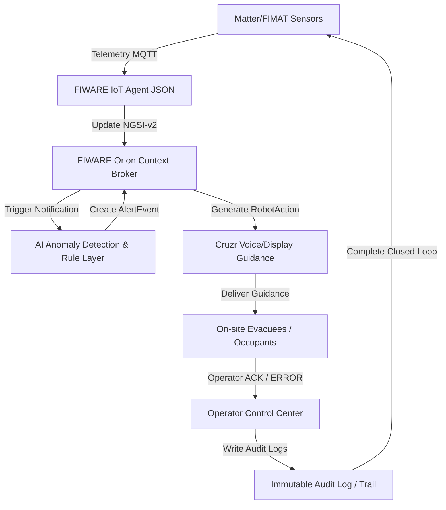

# DNTU02 CruzrTwin ASEAN — Project Guide

This document serves as the single source of truth for the **DNTU02 CruzrTwin ASEAN** system integration, specifically focusing on **Part 5: AI + Rule Layer** and **Part 6: AlertEvent**. All historical reports, test plans, walk-throughs, and development artifacts have been merged here to keep the project clean and focused.

---

## 1. Project Overview

**CruzrTwin ASEAN** is a Cyber-Physical System (CPS) designed to close the *"Last-Meter Response Gap"* in smart public buildings. Standard smart building systems passively display sensor alerts on central operator dashboards, creating significant response lag. This project integrates IoT sensors, FIWARE Orion, AI Anomaly Detection, a Rule Layer, and Cruzr Robot guidance to demonstrate a closed-loop response to indoor environment incidents (such as high temperatures, abnormal power consumption, gas/CO2 elevation, and smoke).

---

## 2. System Flow

The system processes telemetry dynamically from sensing devices up to physical response and audit logging in a closed loop:



### Flow Step-by-Step:
1. **Matter/FIMAT Sensors:** Room sensors (Temperature, Humidity, smoke density, CO2, smart plugs) transmit telemetry via MQTT.
2. **FIWARE IoT Agent & Orion:** The IoT Agent translates MQTT JSON payloads to NGSI-v2 entities, updating the digital twin state of the room in the **Orion Context Broker**.
3. **Webhook Receiver & Pipeline:** Orion triggers a webhook to `webhook_receiver.py` upon telemetry changes, calling `process_sensor_event`.
4. **AI Detection & Rule Layer:** The pipeline runs an **Isolation Forest** model to estimate multivariate anomaly scores, followed by a **Rule Layer** to determine the incident severity (`normal`, `warning`, or `critical`) and explain the cause (`rationale`).
5. **AlertEvent:** For warnings or critical incidents, the system creates/updates an `AlertEvent` entity in Orion and logs the state.
6. **RobotAction:** If critical, the system creates a `RobotAction` (state: `PENDING`) requesting voice and display evacuation guidance.
7. **Evacuation Guidance:** The Cruzr simulator/robot reads `PENDING` actions, updates status to `NAVIGATING` / `DELIVERED`, and plays voice alerts.
8. **Operator ACK & Audit Log:** The operator approves the action (status: `RESOLVED` / `COMPLETED`), appending an immutable entry to the audit logs.

---

## 3. My Main Scope

The specific focus of this implementation is the core analytical and alerting loop:
* **Task 5: AI + Rule Layer** (Isolation Forest model inference & Rule Engine triggers)
* **Task 6: AlertEvent** (Lifecycle management, logging, Orion Context Broker synchronization, and idempotency)

This layer resides directly in the middle of the closed-loop telemetry process:
$$\text{FIWARE Orion Payload} \longrightarrow \mathbf{\text{AI + Rule Layer}} \longrightarrow \mathbf{\text{AlertEvent Creation}} \longrightarrow \text{RobotAction Trigger}$$

### Key Mechanisms:
* **Normal-only Boundary Learning:** The Isolation Forest model is trained exclusively on normal telemetry data (label `0`). During evaluation, it detects multivariate deviations and outputs an `anomaly_score`.
* **Hybrid Rule Layer:** If the data deviates from normal bounds, a secondary rule engine checks for specific threshold violations (e.g. Temperature $\ge 38^\circ\text{C}$, smoke $\ge 300$, CO2 $\ge 900$, or combinations of elevated metrics) to classify the event as `warning` or `critical`.
* **Idempotency:** The Alert Service maintains a localized cache to prevent duplicate alerts or repeated API requests to Orion for the same scenario run.

---

## 4. Key Runtime Modules

* **[src/ai/detector.py](file:///c:/Users/asus/Videos/DNTU02_CruzrTwin_Top8_Evidence-khoaduc/DNTU02_CruzrTwin_Top8_Evidence-khoaduc/src/ai/detector.py)**: Profile-driven Isolation Forest anomaly detection.
* **[src/ai/rule_engine.py](file:///c:/Users/asus/Videos/DNTU02_CruzrTwin_Top8_Evidence-khoaduc/DNTU02_CruzrTwin_Top8_Evidence-khoaduc/src/ai/rule_engine.py)**: Dynamic baseline-driven rule verification and recommended action assignment.
* **[src/orchestration/task_5_6_pipeline.py](file:///c:/Users/asus/Videos/DNTU02_CruzrTwin_Top8_Evidence-khoaduc/DNTU02_CruzrTwin_Top8_Evidence-khoaduc/src/orchestration/task_5_6_pipeline.py)**: Directs parsing, data validation, AI evaluation, and logs dispatching.
* **[src/alerts/alert_service.py](file:///c:/Users/asus/Videos/DNTU02_CruzrTwin_Top8_Evidence-khoaduc/DNTU02_CruzrTwin_Top8_Evidence-khoaduc/src/alerts/alert_service.py)**: AlertEvent lifecycle, RobotAction bootstrapping, idempotency filters, and Orion update client.
* **[src/fiware/webhook_receiver.py](file:///c:/Users/asus/Videos/DNTU02_CruzrTwin_Top8_Evidence-khoaduc/DNTU02_CruzrTwin_Top8_Evidence-khoaduc/src/fiware/webhook_receiver.py)**: Webhook endpoint for Orion notifications and operator acknowledgment interface.
* **[src/robot/cruzr_simulator.py](file:///c:/Users/asus/Videos/DNTU02_CruzrTwin_Top8_Evidence-khoaduc/DNTU02_CruzrTwin_Top8_Evidence-khoaduc/src/robot/cruzr_simulator.py)**: Simulated Cruzr client daemon to poll and handle `RobotAction`.
* **[scripts/data_generation/generate_sensor_data.py](file:///c:/Users/asus/Videos/DNTU02_CruzrTwin_Top8_Evidence-khoaduc/DNTU02_CruzrTwin_Top8_Evidence-khoaduc/scripts/data_generation/generate_sensor_data.py)**: Generates logical 30-day (1-month) sensor telemetry dataset.
* **[scripts/training/build_sensor_profile.py](file:///c:/Users/asus/Videos/DNTU02_CruzrTwin_Top8_Evidence-khoaduc/DNTU02_CruzrTwin_Top8_Evidence-khoaduc/scripts/training/build_sensor_profile.py)**: Computes hourly, day-type, and global baseline profiles from normal rows only.
* **[scripts/training/train_anomaly_model.py](file:///c:/Users/asus/Videos/DNTU02_CruzrTwin_Top8_Evidence-khoaduc/DNTU02_CruzrTwin_Top8_Evidence-khoaduc/scripts/training/train_anomaly_model.py)**: Tunes and trains the anomaly Isolation Forest model.
* **[scripts/demo/run_task_5_6_demo.py](file:///c:/Users/asus/Videos/DNTU02_CruzrTwin_Top8_Evidence-khoaduc/DNTU02_CruzrTwin_Top8_Evidence-khoaduc/scripts/demo/run_task_5_6_demo.py)**: Replays 3 scenarios (Normal, Warning, Critical) to run the pipeline.
* **[scripts/tools/reset_task_5_6_outputs.py](file:///c:/Users/asus/Videos/DNTU02_CruzrTwin_Top8_Evidence-khoaduc/DNTU02_CruzrTwin_Top8_Evidence-khoaduc/scripts/tools/reset_task_5_6_outputs.py)**: Cleans all runtime output files, logs, and evidence caches.
* **[scripts/tools/assert_task_5_6_acceptance.py](file:///c:/Users/asus/Videos/DNTU02_CruzrTwin_Top8_Evidence-khoaduc/DNTU02_CruzrTwin_Top8_Evidence-khoaduc/scripts/tools/assert_task_5_6_acceptance.py)**: Asserts correct system outputs for acceptance criteria.
* **[scripts/tools/show_demo_trace.py](file:///c:/Users/asus/Videos/DNTU02_CruzrTwin_Top8_Evidence-khoaduc/DNTU02_CruzrTwin_Top8_Evidence-khoaduc/scripts/tools/show_demo_trace.py)**: Inspects and displays the chronological closed-loop trace step-by-step.

---

## 5. How to Install

1. Create a Python virtual environment:
   ```bash
   python -m venv .venv
   ```
2. Activate the virtual environment:
   * **Windows Powershell:** `.venv\Scripts\Activate.ps1`
   * **Windows CMD:** `.venv\Scripts\activate.bat`
   * **Linux/macOS:** `source .venv/bin/activate`
3. Install required dependencies:
   ```bash
   pip install -r requirements.txt
   ```

---

## 6. How to Run All Tests

To run the entire system regression suite (65 passed tests):
```powershell
.venv\Scripts\python -m pytest --tb=short -q
```

---

## 7. How to Run My Scope Tests — Tasks 5–6

To run unit and integration tests strictly within the AI detection and AlertEvent scope (50 passed tests):
```powershell
.venv\Scripts\python -m pytest tests/unit/test_ai_detector.py tests/unit/test_rule_engine.py tests/unit/test_alert_service.py tests/unit/test_ai_training_normal_only.py tests/unit/test_data_loader.py tests/integration/test_integration_flow.py tests/integration/test_closed_loop_task_5_6.py --tb=short -q
```

---

## 7.5. How to Train AI & Generate Sensor Baseline Profile

The AI Detector and Rule Layer are driven by a dynamic, learned baseline profile (`models/sensor_profile.json`) instead of hardcoded rules. You can rebuild this baseline profile and retrain the Isolation Forest model whenever the dataset changes:

1. **Generate the 30-day (1-month) sensor telemetry dataset**:
   Generates a continuous 30-day dataset (8,640 rows, 5-minute interval) with day/night profiles, weekday/weekend cycles, and realistic anomaly patterns:
   ```powershell
   .venv\Scripts\python scripts/data_generation/generate_sensor_data.py --days 30 --interval-minutes 5 --output data/sensor_data.csv
   ```
   *Primary output:* [sensor_data.csv](file:///c:/Users/asus/Videos/DNTU02_CruzrTwin_Top8_Evidence-khoaduc/DNTU02_CruzrTwin_Top8_Evidence-khoaduc/data/sensor_data.csv).

2. **Build the sensor baseline profile**:
   Ingests the dataset and extracts hourly (0–23), day-type (working_day vs. weekend), and global statistics from **normal rows only** (expected_label == "normal"):
   ```powershell
   .venv\Scripts\python scripts/training/build_sensor_profile.py --input data/sensor_data.csv --output models/sensor_profile.json
   ```
   *Primary output:* [sensor_profile.json](file:///c:/Users/asus/Videos/DNTU02_CruzrTwin_Top8_Evidence-khoaduc/DNTU02_CruzrTwin_Top8_Evidence-khoaduc/models/sensor_profile.json).

3. **Train and Tune the Anomaly model**:
   Evaluates a grid of contamination candidates (0.005 to 0.05), selects the best configuration meeting Precision >= 0.85 and Recall >= 0.80, and trains the final Isolation Forest model:
   ```powershell
   .venv\Scripts\python scripts/training/train_anomaly_model.py
   ```
   *Primary output:* [anomaly_model.pkl](file:///c:/Users/asus/Videos/DNTU02_CruzrTwin_Top8_Evidence-khoaduc/DNTU02_CruzrTwin_Top8_Evidence-khoaduc/models/anomaly_model.pkl).

4. **Evaluate the AI model**:
   Evaluates anomaly detection performance and calculates Precision, Recall, F1-Score, and confusion matrix:
   ```powershell
   .venv\Scripts\python scripts/training/evaluate_ai.py
   ```

*Note: The canonical fields are temperature, humidity, co2, smoke_status, and energy_consumption. The legacy alias `power` is supported for backward compatibility.*

---

## 8. How to Run Demo

1. Reset the logs and output evidence files:
   ```powershell
   .venv\Scripts\python scripts\tools\reset_task_5_6_outputs.py
   ```
2. Run the demo replay suite:
   ```powershell
   .venv\Scripts\python scripts\demo\run_task_5_6_demo.py
   ```
3. Assert the outputs match acceptance requirements:
   ```powershell
   .venv\Scripts\python scripts\tools\assert_task_5_6_acceptance.py
   ```

### Expected Output:
```
NORMAL CASE
AI level: normal
AlertEvent: not created
PASS

WARNING CASE
AI level: warning
AlertEvent: created
Alert level: warning
PASS

CRITICAL CASE
AI level: critical
AlertEvent: created
Alert level: critical
PASS
```

---

## 9. How to Check Logs

All system logs are stored in `logs/` as newline-delimited JSON (JSONL) files.

### 9.1. AI Detection Log (`logs/ai_detection.jsonl`)
Records every evaluation. Schema contains **14 key fields**:
* `demo_run_id`: Run identifier (`DNTU02_TOP8_RUN_2026_001`).
* `timestamp`: ISO 8601 time.
* `scenario_id`: Evaluated scenario ID (e.g. `SCN_CRITICAL_001`).
* `zone_id`: Location identifier (e.g. `DNTU_ROOM_A101`).
* `source`: Sensor input source (`FIWARE_ORION`).
* `model`: Identifier (`rule_assisted_isolation_forest`).
* `sensor_values`: Sub-object containing 6 sensor metrics:
  * `temperature`: Ambient temperature in Celsius.
  * `humidity`: Ambient humidity %.
  * `air_quality_or_co2`: CO2 parts-per-million.
  * `smoke_status`: Normalized binary status (`0` or `1`).
  * `energy_consumption`: Power draw in watts.
  * `raw_smoke_value`: Native analog smoke value.
* `anomaly_score`: Multivariate score from Isolation Forest (float).
* `predicted_level`: Level (`normal`, `warning`, `critical`).
* `expected_label`: Reference tag (or `null` during live runs).
* `rationale`: Descriptive explanation of rules hit.
* `action_code`: Action tag (`NO_ACTION`, `CHECK_ROOM`, `DISPATCH_CRUZR_GUIDANCE`).
* `recommended_action`: Descriptive instruction.
* `source_ai_event_id`: Unique trace ID (`AIEvent:<scenario_id>`).

### 9.2. Alert Event Log (`logs/alert_events.jsonl`)
Records generated AlertEvents. Schema contains **15 key fields**:
* `demo_run_id`, `timestamp`, `scenario_id`, `zone_id`, `source_model`, `anomaly_score`, `source_ai_event_id`.
* `alert_id`: Entity ID (`AlertEvent:<scenario_id>`).
* `level`: Level (`warning` or `critical`).
* `severity`: Matches `level`.
* `status`: Current state (always starts as `ACTIVE`).
* `message`: Summary notification string.
* `action_code`: Action tag.
* `recommended_action`: Fully formatted descriptive sentence (with clean prefixing).
* `orion_upsert_status`: Orion sync status (`SKIPPED_OFFLINE`, `SUCCESS`, or `FAILED`).
* `error_message`: Present only if `orion_upsert_status` is `FAILED`.

### 9.3. Robot Action Log (`logs/robot_actions.jsonl`)
Records triggered robot guidance commands.
* `robot_action_id`: Action ID (`RobotAction:<scenario_id>`).
* `alert_id`, `demo_run_id`, `scenario_id`, `zone_id`, `timestamp`.
* `robot_id`: Targeted robot (`CRUZR_01`).
* `action_type`: Action category (`VOICE_DISPLAY_GUIDANCE`).
* `navigation_mode`: Navigation target (`PREDEFINED_RESPONSE_POINT`).
* `message`: Evacuation text.
* `status`: State (starts as `PENDING`).
* `orion_upsert_status`: Orion update status.

---

## 10. How to Verify AlertEvent on Orion

If the Orion Context Broker is running (e.g. via Docker Compose on port 1026) and `ORION_ENABLED=true` in `.env`:
1. Start Orion context broker:
   ```bash
   docker-compose -f docker/docker-compose.yml up -d
   ```
2. Trigger the critical scenario replay.
3. Verify the entity status via curl:
   ```bash
   curl http://localhost:1026/v2/entities/AlertEvent:SCN_CRITICAL_001 \
     -H "Fiware-Service: cruzrtwin" \
     -H "Fiware-ServicePath: /asean/buildings"
   ```

### Expected NGSI-v2 JSON payload:
```json
{
  "id": "AlertEvent:SCN_CRITICAL_001",
  "type": "AlertEvent",
  "demo_run_id": { "type": "Text", "value": "DNTU02_TOP8_RUN_2026_001" },
  "scenario_id": { "type": "Text", "value": "SCN_CRITICAL_001" },
  "zone_id": { "type": "Text", "value": "DNTU_ROOM_A101" },
  "level": { "type": "Text", "value": "critical" },
  "severity": { "type": "Text", "value": "critical" },
  "status": { "type": "Text", "value": "ACTIVE" },
  "source_model": { "type": "Text", "value": "rule_assisted_isolation_forest" },
  "anomaly_score": { "type": "Number", "value": -0.10393256833379028 },
  "message": { "type": "Text", "value": "Critical indoor-environment anomaly detected." },
  "action_code": { "type": "Text", "value": "DISPATCH_CRUZR_GUIDANCE" },
  "recommended_action": { "type": "Text", "value": "Send Cruzr to response point and request operator acknowledgement. Safety-critical actuation should remain operator-approved or simulated." },
  "source_ai_event_id": { "type": "Text", "value": "AIEvent:SCN_CRITICAL_001" }
}
```

---

## 11. Safety Note

> [!WARNING]
> Safety-critical actuation (such as automatic fire-fighting, physical ventilation controls, or automatic building power isolation) is strictly operator-approved or simulated. The integrated Cruzr Robot only performs `VOICE_DISPLAY_GUIDANCE` to provide emergency evacuation assistance at predefined response points. The system must not claim autonomous actuation over life-safety hardware.

---

## 12. Cleanup Note

All historical markdown reports, walkthroughs, task planners, and test plan files have been consolidated into this unified file (`PROJECT_GUIDE.md`) to keep the project clean.
