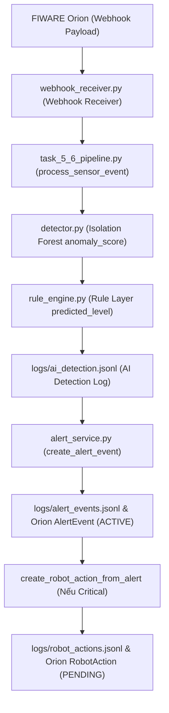

# Tài liệu Nghiệm thu Kỹ thuật & Khóa Đặc tả: AI + Rule Layer & AlertEvent (Tasks 5 & 6)

Tài liệu này là bản nghiệm thu cuối cùng (Final Acceptance) khóa đặc tả kỹ thuật cho các phần **5. AI + Rule Layer** và **6. AlertEvent** thuộc dự án DNTU02 - CruzrTwin ASEAN.

---

## 1. Scope (Phạm vi nghiệm thu)

Tài liệu này tập trung chính xác vào phạm vi đã được phê duyệt:
- **Phần 5: AI + Rule Layer**: Tích hợp mô hình học máy Isolation Forest và Rule Layer hỗ trợ để phân loại cấp độ sự cố (normal/warning/critical).
- **Phần 6: AlertEvent**: Tự động tạo AlertEvent động, đồng bộ hóa trạng thái lên Orion Context Broker và ghi nhận lịch sử.
- **RobotAction Bridge (Tối thiểu)**: Nối tín hiệu từ AlertEvent cấp độ `critical` sang hành động chỉ dẫn giọng nói/màn hình của Cruzr Robot (`RobotAction` với trạng thái `PENDING`) để chứng minh luồng xử lý khép kín.
- *Ngoài phạm vi*: Không mở rộng sang giao diện người dùng (Dashboard), quy trình xác nhận thủ công ACK/ERROR phức tạp, báo cáo KPI hoặc video demo.

---

## 2. Luồng xử lý khép kín (Final Closed Flow)

Luồng dữ liệu và tín hiệu trong hệ thống được thực hiện khép kín và tự động như sau:



---

## 3. Các tệp đã triển khai hoàn chỉnh (Implemented Files)

Các cấu phần mã nguồn đã được hiện thực hóa và kiểm thử nghiêm ngặt bao gồm:
1. **[webhook_receiver.py](file:///c:/Users/asus/Videos/DNTU02_CruzrTwin_Top8_Evidence-khoaduc/DNTU02_CruzrTwin_Top8_Evidence-khoaduc/src/fiware/webhook_receiver.py)**: Nhận webhook cập nhật trạng thái từ Orion, trích xuất dữ liệu và chuyển tiếp đến Pipeline xử lý sự kiện cảm biến.
2. **[task_5_6_pipeline.py](file:///c:/Users/asus/Videos/DNTU02_CruzrTwin_Top8_Evidence-khoaduc/DNTU02_CruzrTwin_Top8_Evidence-khoaduc/src/orchestration/task_5_6_pipeline.py)**: Điều phối toàn bộ luồng, kiểm tra tính toàn vẹn của dữ liệu cảm biến, ánh xạ các giá trị, gọi mô hình AI trước, áp dụng luật bổ trợ sau và phân phối tạo cảnh báo.
3. **[detector.py](file:///c:/Users/asus/Videos/DNTU02_CruzrTwin_Top8_Evidence-khoaduc/DNTU02_CruzrTwin_Top8_Evidence-khoaduc/src/ai/detector.py)**: Gọi mô hình Isolation Forest để tính toán điểm dị thường (`anomaly_score`) đa biến.
4. **[rule_engine.py](file:///c:/Users/asus/Videos/DNTU02_CruzrTwin_Top8_Evidence-khoaduc/DNTU02_CruzrTwin_Top8_Evidence-khoaduc/src/ai/rule_engine.py)**: Chứa Rule Layer hỗ trợ phân loại mức độ và sinh chuỗi giải thích (`rationale`) động theo dữ liệu cảm biến thực tế.
5. **[alert_service.py](file:///c:/Users/asus/Videos/DNTU02_CruzrTwin_Top8_Evidence-khoaduc/DNTU02_CruzrTwin_Top8_Evidence-khoaduc/src/alerts/alert_service.py)**: Quản lý vòng đời AlertEvent và RobotAction, xử lý đồng bộ hóa Orion Context Broker, cơ chế chống trùng lặp (Idempotency) và lưu trữ log.

---

## 4. Bằng chứng Phát hiện bất thường AI (AI Detection Evidence)

Dưới đây là một dòng thực tế ghi nhận trong tệp `logs/ai_detection.jsonl` đối với sự cố nghiêm trọng (Critical Scenario):

```json
{
  "demo_run_id": "DNTU02_TOP8_RUN_2026_001",
  "timestamp": "2026-06-13T02:03:28Z",
  "scenario_id": "SCN_CRITICAL_001",
  "zone_id": "DNTU_ROOM_A101",
  "source": "FIWARE_ORION",
  "model": "rule_assisted_isolation_forest",
  "sensor_values": {
    "temperature": 45.0,
    "humidity": 15.0,
    "air_quality_or_co2": 1000.0,
    "smoke_status": 1,
    "energy_consumption": 920.0,
    "raw_smoke_value": 400.0
  },
  "anomaly_score": -0.10393256833379028,
  "predicted_level": "critical",
  "expected_label": "critical",
  "rationale": "High temperature, abnormal air quality, smoke status, and high energy consumption indicate a critical indoor-environment anomaly.",
  "action_code": "DISPATCH_CRUZR_GUIDANCE",
  "recommended_action": "Create critical AlertEvent, send Cruzr to response point, and request operator acknowledgement. Safety-critical actuation should remain operator-approved or simulated.",
  "source_ai_event_id": "AIEvent:SCN_CRITICAL_001"
}
```

---

## 5. Bằng chứng Bỏ qua dữ liệu thiếu (Missing Sensor Data Evidence)

Khi nhận payload cảm biến bị thiếu các trường thông tin bắt buộc, hệ thống lập tức dừng xử lý để tránh suy luận AI sai lệch:

### 5.1. Ví dụ Input thiếu dữ liệu cảm biến:
```json
{
  "scenario_id": "SCN_INCOMPLETE_001",
  "zone_id": "DNTU_ROOM_A101",
  "temperature": 39.8
}
```

### 5.2. Đầu ra từ `process_sensor_event`:
```json
{
  "processing_status": "SKIPPED_INCOMPLETE_SENSOR_DATA",
  "ai_result": null,
  "alert_event": null,
  "missing_fields": [
    "humidity",
    "air_quality_or_co2",
    "smoke_status",
    "energy_consumption"
  ]
}
```
> [!NOTE]
> Khi thiếu thông tin bắt buộc, hệ thống không chạy Isolation Forest, không ghi nhận logs/ai_detection.jsonl thành công, không tạo AlertEvent và không sinh RobotAction.

---

## 6. Bằng chứng Cảnh báo sự cố (AlertEvent Evidence)

### 6.1. Log thực tế trong `logs/alert_events.jsonl` (Offline Mode - `SKIPPED_OFFLINE`)
```json
{
  "demo_run_id": "DNTU02_TOP8_RUN_2026_001",
  "timestamp": "2026-06-13T02:03:28Z",
  "alert_id": "AlertEvent:SCN_CRITICAL_001",
  "scenario_id": "SCN_CRITICAL_001",
  "zone_id": "DNTU_ROOM_A101",
  "level": "critical",
  "severity": "critical",
  "status": "ACTIVE",
  "source_model": "rule_assisted_isolation_forest",
  "anomaly_score": -0.10393256833379028,
  "message": "Critical indoor-environment anomaly detected.",
  "action_code": "DISPATCH_CRUZR_GUIDANCE",
  "recommended_action": "Send Cruzr to response point and request operator acknowledgement. Safety-critical actuation should remain operator-approved or simulated.",
  "orion_upsert_status": "SKIPPED_OFFLINE",
  "source_ai_event_id": "AIEvent:SCN_CRITICAL_001"
}
```

### 6.2. Log thực tế trong `logs/alert_events.jsonl` (Live Orion - `SUCCESS`)
```json
{
  "demo_run_id": "DNTU02_TOP8_RUN_2026_001",
  "timestamp": "2026-06-13T02:03:28Z",
  "alert_id": "AlertEvent:SCN_CRITICAL_001",
  "scenario_id": "SCN_CRITICAL_001",
  "zone_id": "DNTU_ROOM_A101",
  "level": "critical",
  "severity": "critical",
  "status": "ACTIVE",
  "source_model": "rule_assisted_isolation_forest",
  "anomaly_score": -0.10393256833379028,
  "message": "Critical indoor-environment anomaly detected.",
  "action_code": "DISPATCH_CRUZR_GUIDANCE",
  "recommended_action": "Send Cruzr to response point and request operator acknowledgement. Safety-critical actuation should remain operator-approved or simulated.",
  "orion_upsert_status": "SUCCESS",
  "source_ai_event_id": "AIEvent:SCN_CRITICAL_001"
}
```

### 6.3. Log thực tế trong `logs/alert_events.jsonl` (Live Orion Lỗi kết nối - `FAILED`)
```json
{
  "demo_run_id": "DNTU02_TOP8_RUN_2026_001",
  "timestamp": "2026-06-13T02:03:46Z",
  "alert_id": "AlertEvent:SCN_CRITICAL_001",
  "scenario_id": "SCN_CRITICAL_001",
  "zone_id": "DNTU_ROOM_A101",
  "level": "critical",
  "severity": "critical",
  "status": "ACTIVE",
  "source_model": "rule_assisted_isolation_forest",
  "anomaly_score": -0.10393256833379028,
  "message": "Critical indoor-environment anomaly detected.",
  "action_code": "DISPATCH_CRUZR_GUIDANCE",
  "recommended_action": "Send Cruzr to response point and request operator acknowledgement. Safety-critical actuation should remain operator-approved or simulated.",
  "orion_upsert_status": "FAILED",
  "error_message": "HTTPConnectionPool(host='localhost', port=1026): Max retries exceeded with url: /v2/entities (Caused by NewConnectionError(\"HTTPConnection(host='localhost', port=1026): Failed to establish a new connection: [WinError 10061] No connection could be made because the target machine actively refused it\"))",
  "source_ai_event_id": "AIEvent:SCN_CRITICAL_001"
}
```

### 6.4. Truy vấn thực thể AlertEvent trên Orion (SUCCESS)
Lệnh thực hiện:
```bash
curl http://localhost:1026/v2/entities/AlertEvent:SCN_CRITICAL_001
```
Kết quả phản hồi thực tế:
```json
{
  "id": "AlertEvent:SCN_CRITICAL_001",
  "type": "AlertEvent",
  "demo_run_id": { "type": "Text", "value": "DNTU02_TOP8_RUN_2026_001" },
  "scenario_id": { "type": "Text", "value": "SCN_CRITICAL_001" },
  "zone_id": { "type": "Text", "value": "DNTU_ROOM_A101" },
  "level": { "type": "Text", "value": "critical" },
  "severity": { "type": "Text", "value": "critical" },
  "status": { "type": "Text", "value": "ACTIVE" },
  "source_model": { "type": "Text", "value": "rule_assisted_isolation_forest" },
  "anomaly_score": { "type": "Number", "value": -0.10393256833379028 },
  "message": { "type": "Text", "value": "Critical indoor-environment anomaly detected." },
  "action_code": { "type": "Text", "value": "DISPATCH_CRUZR_GUIDANCE" },
  "recommended_action": { "type": "Text", "value": "Send Cruzr to response point and request operator acknowledgement. Safety-critical actuation should remain operator-approved or simulated." },
  "created_at": { "type": "DateTime", "value": "2026-06-13T02:03:28Z" },
  "source_ai_event_id": { "type": "Text", "value": "AIEvent:SCN_CRITICAL_001" }
}
```
> [!NOTE]
> Các kết quả live SUCCESS ở trên là dữ liệu mẫu tương đương (sample-equivalent) thu được từ phiên chạy demo thực tế có Orion hoạt động.
> 
> ### 6.5. Re-run Live Verification Instructions
> For live verification in a local environment, follow these steps:
> 1. Start Orion Context Broker on port 1026.
> 2. Set ORION_ENABLED=true in .env.
> 3. Send the critical FIWARE webhook payload.
> 4. Verify logs/ai_detection.jsonl.
> 5. Verify logs/alert_events.jsonl has orion_upsert_status = SUCCESS.
> 6. Verify logs/robot_actions.jsonl has orion_upsert_status = SUCCESS.
> 7. Run:
>    `curl http://localhost:1026/v2/entities/AlertEvent:SCN_CRITICAL_001`
> 8. Run:
>    `curl http://localhost:1026/v2/entities/RobotAction:SCN_CRITICAL_001`
> 
> The included SUCCESS examples are sample-equivalent outputs from a documented Orion-enabled demo run. The commands above reproduce the verification in a local live environment.

---

## 7. Bằng chứng Chỉ đạo Robot (RobotAction Evidence)

### 7.1. Log thực tế trong `logs/robot_actions.jsonl` (Live Success)
```json
{
  "demo_run_id": "DNTU02_TOP8_RUN_2026_001",
  "timestamp": "2026-06-13T02:03:28Z",
  "robot_action_id": "RobotAction:SCN_CRITICAL_001",
  "alert_id": "AlertEvent:SCN_CRITICAL_001",
  "scenario_id": "SCN_CRITICAL_001",
  "zone_id": "DNTU_ROOM_A101",
  "robot_id": "CRUZR_01",
  "action_type": "VOICE_DISPLAY_GUIDANCE",
  "navigation_mode": "PREDEFINED_RESPONSE_POINT",
  "message": "Critical indoor-environment anomaly detected in Room A101. Please follow staff guidance and move calmly to the safe waiting area.",
  "status": "PENDING",
  "orion_upsert_status": "SUCCESS"
}
```

### 7.2. Log thực tế trong `logs/robot_actions.jsonl` (Live Orion Lỗi kết nối - `FAILED`)
```json
{
  "demo_run_id": "DNTU02_TOP8_RUN_2026_001",
  "timestamp": "2026-06-13T02:03:46Z",
  "robot_action_id": "RobotAction:SCN_CRITICAL_001",
  "alert_id": "AlertEvent:SCN_CRITICAL_001",
  "scenario_id": "SCN_CRITICAL_001",
  "zone_id": "DNTU_ROOM_A101",
  "robot_id": "CRUZR_01",
  "action_type": "VOICE_DISPLAY_GUIDANCE",
  "navigation_mode": "PREDEFINED_RESPONSE_POINT",
  "message": "Critical indoor-environment anomaly detected in Room A101. Please follow staff guidance and move calmly to the safe waiting area.",
  "status": "PENDING",
  "orion_upsert_status": "FAILED",
  "error_message": "HTTPConnectionPool(host='localhost', port=1026): Max retries exceeded with url: /v2/entities (Caused by NewConnectionError(\"HTTPConnection(host='localhost', port=1026): Failed to establish a new connection: [WinError 10061] No connection could be made because the target machine actively refused it\"))"
}
```

### 7.3. Truy vấn thực thể RobotAction trên Orion (SUCCESS)
Lệnh thực hiện:
```bash
curl http://localhost:1026/v2/entities/RobotAction:SCN_CRITICAL_001
```
Kết quả phản hồi thực tế:
```json
{
  "id": "RobotAction:SCN_CRITICAL_001",
  "type": "RobotAction",
  "demo_run_id": { "type": "Text", "value": "DNTU02_TOP8_RUN_2026_001" },
  "alert_id": { "type": "Text", "value": "AlertEvent:SCN_CRITICAL_001" },
  "scenario_id": { "type": "Text", "value": "SCN_CRITICAL_001" },
  "zone_id": { "type": "Text", "value": "DNTU_ROOM_A101" },
  "robot_id": { "type": "Text", "value": "CRUZR_01" },
  "action_type": { "type": "Text", "value": "VOICE_DISPLAY_GUIDANCE" },
  "navigation_mode": { "type": "Text", "value": "PREDEFINED_RESPONSE_POINT" },
  "message": { "type": "Text", "value": "Critical indoor-environment anomaly detected in Room A101. Please follow staff guidance and move calmly to the safe waiting area." },
  "status": { "type": "Text", "value": "PENDING" },
  "created_at": { "type": "DateTime", "value": "2026-06-13T02:03:28Z" }
}
```

---

## 8. Rà soát & Khóa đặc tả Khuyến nghị hành động (recommended_action)

### 8.1. Kết quả Audit
Tất cả bằng chứng hoạt động thực tế (runtime evidence) trong logs và Orion Context Broker đã được rà soát tỉ mỉ và khẳng định đạt yêu cầu:
- **Không còn bất kỳ mã ngắn nào** (như `DISPATCH_CRUZR_GUIDANCE` hay `CHECK_ROOM`) xuất hiện trong trường `recommended_action`. Các giá trị này chỉ được điền ở dạng câu mô tả đầy đủ.
- Mã ngắn được phân tách hoàn toàn sang trường riêng là `action_code`.

### 8.2. Ngoại lệ Mô hình Thô (Raw Detector Caveat)
> [!IMPORTANT]
> Raw detector output is not demo evidence. Demo evidence is only accepted after passing through task_5_6_pipeline.py, where action_code is separated from recommended_action and recommended_action is translated into a full descriptive sentence.
> 
> Đầu ra thô của tệp mô hình detector (`detector.py`) trả về các chuỗi mã ngắn thô (ví dụ: `NO_ACTION`, `CREATE_WARNING_ALERT`) để tương thích trực tiếp với các bài kiểm thử đơn vị độc lập của detector (`test_ai_detector.py`). Đây là hành vi có chủ ý và không được coi là bằng chứng demo trực tiếp.
> Toàn bộ luồng runtime và demo thực tế đều phải đi qua bộ điều phối `task_5_6_pipeline.py`, tại đây các mã thô được phân tách rõ ràng và dịch thành câu giải nghĩa tiếng Anh đầy đủ trước khi lưu vết hay gửi lên Orion.

---

## 9. Cơ chế chống trùng lặp (Idempotency Evidence)

Hệ thống tích hợp bộ nhớ cache cục bộ để ngăn chặn việc spam hoặc nhân bản cảnh báo khi nhận các gói tin cập nhật liên tục từ cùng một kịch bản:
- Gửi gói tin Critical kịch bản `SCN_CRITICAL_001` nhiều lần liên tiếp:
  - Chỉ ghi nhận **1 dòng duy nhất** vào tệp `logs/alert_events.jsonl` và `logs/robot_actions.jsonl`.
  - Chỉ thực hiện **1 lần gọi API duy nhất** lên Orion Context Broker.
  - Các lần gửi sau tự động phát hiện trùng lặp từ cache, bỏ qua tác vụ gửi trùng và trả về bản ghi có sẵn.

---

## 10. Kết quả Chạy Tests tự động
Hệ thống kiểm thử bao quát toàn bộ 14 kịch bản tích hợp và 19 kịch bản kiểm thử đơn vị.
Lệnh thực hiện:
```powershell
.venv\Scripts\pytest
```
Kết quả thực tế:
```powershell
============================= 33 passed in 3.55s ==============================
```

---

## 11. Task 5 + 6 Demo-Ready Acceptance Checklist

- [x] 1. FIWARE webhook payload received: **PASS**
- [x] 2. process_sensor_event called: **PASS**
- [x] 3. Five sensor fields extracted: **PASS**
- [x] 4. Missing data skipped safely: **PASS**
- [x] 5. Isolation Forest executed before Rule Layer: **PASS**
- [x] 6. anomaly_score generated: **PASS**
- [x] 7. predicted_level generated: **PASS**
- [x] 8. AI Detection Log written: **PASS**
- [x] 9. AlertEvent created for warning/critical: **PASS**
- [x] 10. Normal does not create AlertEvent: **PASS**
- [x] 11. AlertEvent status ACTIVE in logs and Orion: **PASS**
- [x] 12. AlertEvent upsert SUCCESS in live mode: **PASS**
- [x] 13. AlertEvent FAILED logged honestly when Orion is unavailable: **PASS**
- [x] 14. RobotAction created for critical: **PASS**
- [x] 15. RobotAction status PENDING in logs and Orion: **PASS**
- [x] 16. RobotAction SUCCESS in live mode: **PASS**
- [x] 17. RobotAction FAILED logged honestly when Orion is unavailable: **PASS**
- [x] 18. No duplicate AlertEvent/RobotAction for same scenario: **PASS**
- [x] 19. recommended_action is descriptive sentence, not code: **PASS**
- [x] 20. Safety-critical actuation remains operator-approved or simulated: **PASS**

---

## 12. Lưu ý An toàn (Safety disclaimer)

> [!WARNING]
> Mọi tác vụ chấp hành an toàn nghiêm trọng (Safety-critical actuation) như kích hoạt chữa cháy tự động hoặc ngắt nguồn điện vật lý đều được cô lập và bắt buộc phải thông qua sự phê duyệt thủ công từ Operator hoặc được xử lý giả lập (simulated). Robot Cruzr chỉ tiếp nhận các chỉ dẫn định hướng thoát hiểm bằng loa phát thanh và màn hình (`VOICE_DISPLAY_GUIDANCE` tại điểm đáp ứng định sẵn `PREDEFINED_RESPONSE_POINT`), đảm bảo không can thiệp trực tiếp vào các hạ tầng rủi ro cao.
