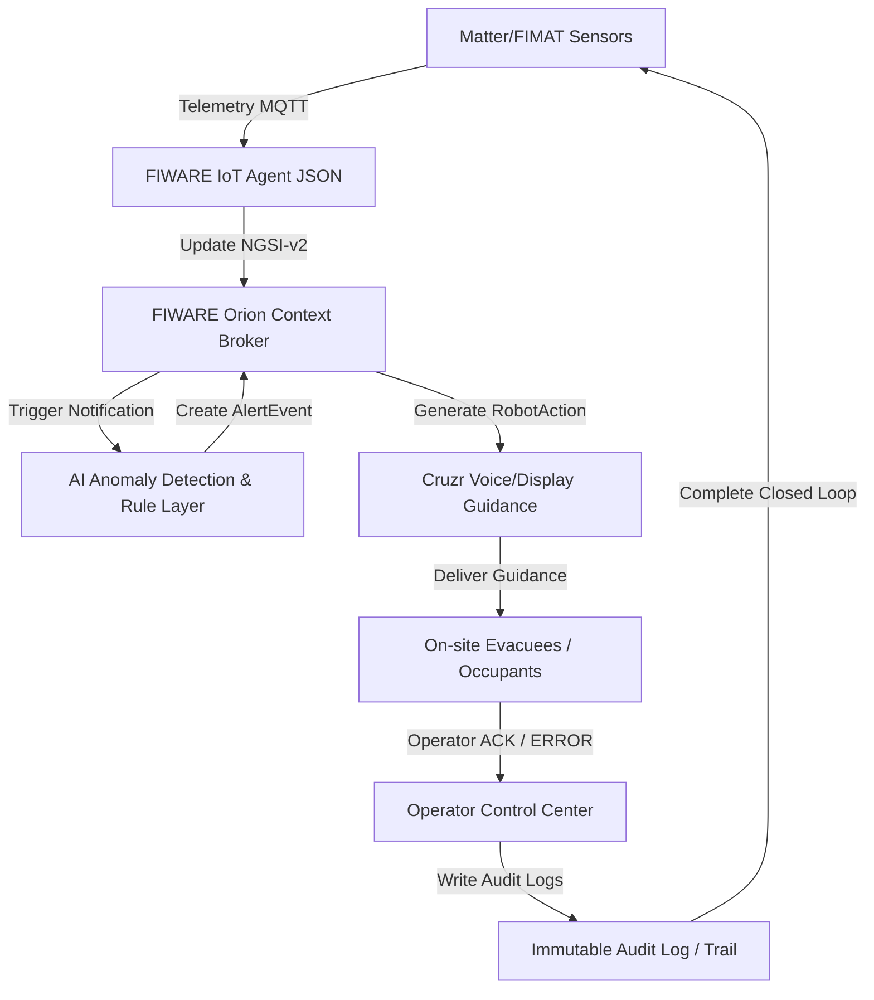

# Báo cáo Đánh giá Kỹ thuật Dự án DNTU02 — CruzrTwin ASEAN

## 1. Tóm tắt Mục tiêu Dự án & Vòng lặp Khép kín (Closed-Loop)
Mục tiêu cốt lõi của dự án **CruzrTwin ASEAN** là giải quyết bài toán **"Last-Meter Response Gap"** (Khoảng trống phản ứng ở mét cuối cùng) trong các tòa nhà công cộng thông minh. Hệ thống thông thường chỉ phát hiện sự cố thụ động qua cảm biến và hiển thị cảnh báo lên màn hình trung tâm giám sát (dashboard), đòi hỏi người vận hành xử lý thủ công, dẫn đến độ trễ cao và thiếu hướng dẫn tức thời cho người tại hiện trường.

Dự án CruzrTwin ASEAN không chỉ đơn thuần là một trang Dashboard, một Chatbot thông tin, một robot trình diễn đơn lẻ hay một mô hình phát hiện dị thường (AI Anomaly Detection) cô lập. Nó là một **Hệ thống Vật lý Không gian mạng (Cyber-Physical System - CPS)** hoàn chỉnh nhằm chứng minh một **vòng lặp phản hồi khép kín (closed-loop response loop)**:



**Các bước cụ thể trong chuỗi phản hồi khép kín:**
1. **Matter/FIMAT Sensors:** Cảm biến trong phòng (nhiệt độ, khói, CO2, năng lượng tiêu thụ) gửi dữ liệu.
2. **FIWARE Orion Context Broker:** Nhận dữ liệu cập nhật trạng thái số (Digital Twin) của phòng.
3. **AI Anomaly Detection:** Mô hình AI (Isolation Forest + Rule Layer) phát hiện bất thường và phân loại mức độ nguy hiểm (`warning`, `critical`).
4. **AlertEvent:** Tự động tạo sự kiện cảnh báo có trạng thái `OPEN` trong Orion.
5. **RobotAction:** Kích hoạt Cruzr di chuyển tới điểm phản ứng (response point) và phát hướng dẫn bằng giọng nói + màn hình hiển thị.
6. **Operator ACK/ERROR:** Người vận hành hệ thống xác nhận xử lý hoặc báo lỗi từ giao diện.
7. **Audit Log:** Ghi log toàn bộ lịch sử hành động với nhãn thời gian thống nhất (`timestamp`) và mã chạy demo chung (`demo_run_id`).

---

## 2. Kiểm tra Trạng thái Source Code Hiện tại

Sau khi đối chiếu chi tiết toàn bộ các file trong workspace, dưới đây là tình trạng thực tế của mã nguồn:

| Nhóm Kiểm Tra | File / Module Liên Quan | Hoạt động Thực Tế của Code | Đánh Giá Độ Trùng Khớp với Tài Liệu | Trạng Thái Log / Evidence | Thiếu Liên Kết End-to-End? |
| :--- | :--- | :--- | :--- | :--- | :--- |
| **Matter/FIMAT / Sensor Replay** | [devices.py](file:///c:/Users/asus/Videos/DNTU02_CruzrTwin_Top8_Evidence-khoaduc/DNTU02_CruzrTwin_Top8_Evidence-khoaduc/src/iot/devices.py)<br>[register.py](file:///c:/Users/asus/Videos/DNTU02_CruzrTwin_Top8_Evidence-khoaduc/DNTU02_CruzrTwin_Top8_Evidence-khoaduc/src/fimat/register.py)<br>[mqtt_helper.py](file:///c:/Users/asus/Videos/DNTU02_CruzrTwin_Top8_Evidence-khoaduc/DNTU02_CruzrTwin_Top8_Evidence-khoaduc/src/utils/mqtt_helper.py)<br>[scenarios/](file:///c:/Users/asus/Videos/DNTU02_CruzrTwin_Top8_Evidence-khoaduc/DNTU02_CruzrTwin_Top8_Evidence-khoaduc/scripts/scenarios) | Cấu hình các thiết bị đo cảm biến (Nhiệt độ, Khói, Khí độc, Smart Plug) gửi dữ liệu qua MQTT broker giả lập. | Đúng thiết kế. Dùng IoT Agent JSON để map MQTT JSON thành NGSI-v2 entities. | Log ghi vào `logs/orion_sync.jsonl`. | **Không thiếu.** Dữ liệu sensor đã gửi thành công lên MQTT broker để cập nhật Orion. |
| **FIWARE Orion Integration** | [client.py](file:///c:/Users/asus/Videos/DNTU02_CruzrTwin_Top8_Evidence-khoaduc/DNTU02_CruzrTwin_Top8_Evidence-khoaduc/src/fiware/client.py)<br>[subscription.py](file:///c:/Users/asus/Videos/DNTU02_CruzrTwin_Top8_Evidence-khoaduc/DNTU02_CruzrTwin_Top8_Evidence-khoaduc/src/fiware/subscription.py)<br>[webhook_receiver.py](file:///c:/Users/asus/Videos/DNTU02_CruzrTwin_Top8_Evidence-khoaduc/DNTU02_CruzrTwin_Top8_Evidence-khoaduc/src/fiware/webhook_receiver.py) | Gửi request HTTP lên Orion Context Broker. Cài đặt Subscription giám sát `Device:.*` để gửi webhook. Nhận webhook và cập nhật dữ liệu của Room. | Đúng thiết kế API và Webhook cơ bản. | Không có log thực tế được ghi nhận khi webhook nhận tín hiệu. | **Cực kỳ thiếu liên kết.** Webhook nhận dữ liệu từ Orion nhưng chỉ gọi cập nhật Room (`update_room_sensors`) mà **không hề gọi AI detection** để sinh AlertEvent tự động! |
| **Room / Device Entity** | [devices.py](file:///c:/Users/asus/Videos/DNTU02_CruzrTwin_Top8_Evidence-khoaduc/DNTU02_CruzrTwin_Top8_Evidence-khoaduc/src/iot/devices.py)<br>[create_entities_required.py](file:///c:/Users/asus/Videos/DNTU02_CruzrTwin_Top8_Evidence-khoaduc/DNTU02_CruzrTwin_Top8_Evidence-khoaduc/src/fiware/entities/create_entities_required.py) | Bootstrap khởi tạo các Room, Device, AlertEvent, RobotAction ban đầu vào Orion. | Đúng thiết kế schema thực tế. | Log được in ra terminal thông báo bootstrap thành công. | **Không thiếu.** Các entity tĩnh được khai báo và tạo đúng cách. |
| **AlertEvent Entity** | [alert_service.py](file:///c:/Users/asus/Videos/DNTU02_CruzrTwin_Top8_Evidence-khoaduc/DNTU02_CruzrTwin_Top8_Evidence-khoaduc/src/alerts/alert_service.py)<br>[alert_schema.py](file:///c:/Users/asus/Videos/DNTU02_CruzrTwin_Top8_Evidence-khoaduc/DNTU02_CruzrTwin_Top8_Evidence-khoaduc/src/alerts/alert_schema.py) | Tạo cấu trúc dữ liệu AlertEvent cục bộ từ kết quả AI. | Sai hướng hoạt động. | Ghi log cục bộ vào `logs/alert_events.jsonl`. | **Thiếu liên kết lớn.** `alert_service.py` **không gọi Orion Client** để tạo hay cập nhật thực thể `AlertEvent` lên Orion mà chỉ lưu log offline cục bộ. |
| **RobotAction Entity** | [devices.py](file:///c:/Users/asus/Videos/DNTU02_CruzrTwin_Top8_Evidence-khoaduc/DNTU02_CruzrTwin_Top8_Evidence-khoaduc/src/iot/devices.py)<br>[entities_manager.py](file:///c:/Users/asus/Videos/DNTU02_CruzrTwin_Top8_Evidence-khoaduc/DNTU02_CruzrTwin_Top8_Evidence-khoaduc/src/fiware/entities/entities_manager.py) | Chỉ chứa hàm khởi tạo tĩnh `create_robot_action`. | Thiếu logic động. | Chưa có log nào được sinh động. | **Thiếu hoàn toàn liên kết.** Không có logic sinh `RobotAction` tự động khi có AlertEvent mức độ `critical`. |
| **AI Anomaly Detection** | [detector.py](file:///c:/Users/asus/Videos/DNTU02_CruzrTwin_Top8_Evidence-khoaduc/DNTU02_CruzrTwin_Top8_Evidence-khoaduc/src/ai/detector.py)<br>[model_trainer.py](file:///c:/Users/asus/Videos/DNTU02_CruzrTwin_Top8_Evidence-khoaduc/DNTU02_CruzrTwin_Top8_Evidence-khoaduc/src/ai/model_trainer.py)<br>[evaluator.py](file:///c:/Users/asus/Videos/DNTU02_CruzrTwin_Top8_Evidence-khoaduc/DNTU02_CruzrTwin_Top8_Evidence-khoaduc/src/ai/evaluator.py) | Huấn luyện và chạy suy luận Isolation Forest. | Hoạt động tốt offline. | Sinh evidence `ai_metrics.json`, `binary_confusion_matrix.csv`. | **Chưa tích hợp thời gian thực.** Chỉ chạy được bằng script offline, chưa nối vào luồng nhận dữ liệu từ FIWARE. |
| **Rule-assisted Isolation Forest** | [rule_engine.py](file:///c:/Users/asus/Videos/DNTU02_CruzrTwin_Top8_Evidence-khoaduc/DNTU02_CruzrTwin_Top8_Evidence-khoaduc/src/ai/rule_engine.py) | Phân loại `warning`/`critical` dựa trên các ngưỡng của nhiệt độ, khói, khí CO2, điện năng tiêu thụ. | Hoạt động chính xác theo yêu cầu. | Log tích hợp vào kết quả detector. | **Chạy offline.** |
| **Dashboard UI** | Chưa có | **Chưa có gì.** Không có giao diện hiển thị trạng thái `normal/warning/critical` hoặc log trực tuyến. | Chưa có. | Chưa có. | **Chưa có.** Giám khảo sẽ không thấy được visual của Digital Twin. |
| **Cruzr Integration / Fallback** | Chưa có | **Chưa có gì.** Chưa có code gửi lệnh đến Robot hoặc sinh file âm thanh/giọng nói cảnh báo giả lập. | Chưa có. | Không có `logs/robot_actions.jsonl`. | **Bị đứt gãy hoàn toàn.** Không có phản hồi vật lý. |
| **Operator ACK/ERROR** | Chưa có | **Chưa có gì.** Không có nút bấm hay API endpoint để nhận xác nhận ACK/ERROR từ operator. | Chưa có. | Không có `logs/operator_ack.jsonl`. | **Thiếu hoàn toàn.** Không có đóng vòng lặp vận hành (closed-loop loop). |
| **Audit trail/logs** | [logs/](file:///c:/Users/asus/Videos/DNTU02_CruzrTwin_Top8_Evidence-khoaduc/DNTU02_CruzrTwin_Top8_Evidence-khoaduc/logs) | Chỉ có `orion_sync.jsonl`, `ai_detection.jsonl`, `alert_events.jsonl` được viết bởi các script khác nhau. | Rời rạc, chưa thống nhất. | Các file log thiếu sự đồng bộ và thiếu cấu trúc liên kết. | **Thiếu tính liền mạch.** Cần liên kết thông qua một luồng chạy demo duy nhất có mã chung. |
| **Replay test set** | [replay_test_set/](file:///c:/Users/asus/Videos/DNTU02_CruzrTwin_Top8_Evidence-khoaduc/DNTU02_CruzrTwin_Top8_Evidence-khoaduc/data/replay_test_set) | Chứa 30 file dữ liệu JSON (10 normal, 10 warning, 10 critical). | Hoạt động tốt. | Sẵn sàng để replay. | Đã có sẵn nhưng cần script tự động hóa chạy liên tục để sinh ra log đồng loạt. |
| **KPI measurement** | [KPI_SCORECARD.md](file:///c:/Users/asus/Videos/DNTU02_CruzrTwin_Top8_Evidence-khoaduc/DNTU02_CruzrTwin_Top8_Evidence-khoaduc/KPI_SCORECARD.md) | File markdown liệt kê 4 chỉ số KPI cơ bản. | Sơ sài, thiếu nhiều KPI quan trọng về thời gian trễ. | Thiếu dữ liệu thực chứng. | Cần được cập nhật tự động sau khi chạy replay. |
| **TEST_REPORT.md** | [TEST_REPORT.md](file:///c:/Users/asus/Videos/DNTU02_CruzrTwin_Top8_Evidence-khoaduc/DNTU02_CruzrTwin_Top8_Evidence-khoaduc/TEST_REPORT.md) | File báo cáo kết quả kiểm thử mô hình AI. | Đơn giản, chưa có báo cáo kiểm thử tích hợp toàn diện. | Sơ sài. | Cần tích hợp thêm kết quả chạy 30 kịch bản replay. |
| **DEMO_SCRIPT.md** | Chưa có | **Chưa có.** Chưa có kịch bản chi tiết 3 phút. | Chưa có. | Chưa có. | Rủi ro đội ngũ demo nói lan man và không khớp thời gian 3 phút. |
| **README_HACKATHON.md**| Chưa có | **Chưa có.** (Chỉ có README.md mặc định rất đơn giản). | Chưa có. | Chưa có. | Giám khảo vào repo không thấy ngay hướng dẫn chạy demo và kiến trúc. |
| **Privacy/Safety limitations**| Chưa có | **Chưa có.** Chưa ghi rõ chính sách an toàn thông tin (no PII, no Face ID) và an toàn robot. | Chưa có. | Chưa có. | Rủi ro bị trừ điểm về khía cạnh an toàn vận hành thực tế. |

---

## 3. Danh sách Những gì Còn thiếu so với Yêu cầu Đầy đủ

Dưới đây là bảng tổng hợp tất cả khoảng trống nghiệp vụ và kỹ thuật trong mã nguồn:

| Hạng mục cần có | Tình trạng hiện tại | File/Module liên quan | Mức độ | Tác động nếu không có | Việc cần làm cụ thể |
| :--- | :--- | :--- | :--- | :--- | :--- |
| **Kết nối AI Detection vào Webhook** | **Chưa có** | `src/fiware/webhook_receiver.py` | **Critical** | Khi nhận dữ liệu từ cảm biến gửi lên Orion, AI không hề chạy. Vòng lặp đứt gãy ngay từ bước đầu. | Sửa webhook receiver: khi nhận dữ liệu từ sensor, gọi ngay `process_sensor_event` để chạy AI và tự động cập nhật AlertEvent. |
| **Cập nhật AlertEvent lên Orion** | **Chưa có** | `src/alerts/alert_service.py`<br>`src/fiware/entities/entities_manager.py` | **Critical** | Trạng thái AlertEvent chỉ được lưu cục bộ dưới dạng log, Orion không có thực thể AlertEvent động → Dashboard hoặc robot không biết có cảnh báo. | Gọi `create_alert_event` từ Orion client để đồng bộ AlertEvent lên Orion Context Broker thay vì chỉ ghi log cục bộ. |
| **Tự động sinh RobotAction** | **Chưa có** | `src/orchestration/task_5_6_pipeline.py`<br>`src/fiware/entities/entities_manager.py` | **Critical** | Khi xảy ra sự cố `critical`, không có hành động robot tương ứng nào được khởi tạo trong Orion → Robot đứng im không nhận lệnh. | Thêm logic: Nếu AlertEvent là `critical`, tự động gọi `create_robot_action` lên Orion để tạo entity RobotAction với trạng thái `PENDING`. |
| **Cruzr/Fallback Voice & Display** | **Chưa có** | `src/cruzr/` (Cần tạo mới)<br>`logs/robot_actions.jsonl` | **High** | Phần robot chỉ là "đạo cụ trình diễn", không có bằng chứng hệ thống gửi lệnh và phản hồi thực tế của robot. | Tạo module giả lập hoặc bridge kết nối robot, ghi nhận trạng thái chuyển dịch từ `PENDING` -> `NAVIGATING` -> `DELIVERED` và lưu vào `logs/robot_actions.jsonl`. |
| **Operator ACK/ERROR** | **Chưa có** | `src/fiware/webhook_receiver.py`<br>`logs/operator_ack.jsonl` | **High** | Vòng lặp không được đóng lại. Không chứng minh được vai trò giám sát, phê duyệt của con người trước hành động nguy hiểm của robot. | Thêm endpoint `/api/operator/ack` để cập nhật trạng thái AlertEvent thành `ACKED` và lưu vết vào `logs/operator_ack.jsonl`. |
| **Dashboard UI & Audit Logs** | **Chưa có** | `src/dashboard/` (Cần tạo mới) | **High** | Giám khảo không nhìn thấy dữ liệu thời gian thực biến đổi từ Normal -> Warning -> Critical và lịch sử Audit Log. | Xây dựng trang Dashboard HTML/JS đơn giản (hoặc React/Vite) hiển thị trạng thái của Room, các Alerts đang mở, trạng thái Robot, nút bấm cho Operator ACK, và hiển thị Audit Logs trực tiếp. |
| **Unified Demo Logs & Trace** | **Chưa có** | `scripts/tools/show_demo_trace.py`<br>`logs/` | **High** | Các file log bị thiếu hoặc phân mảnh, không khớp định dạng và thiếu `demo_run_id` chung để truy vết. | Đồng bộ hóa tất cả các log sinh ra ở định dạng JSONL thống nhất sử dụng chung `demo_run_id`, `scenario_id` và `zone_id`. Sửa lại script `show_demo_trace.py` để đọc đúng các log thực tế. |
| **Tài liệu Hackathon đầy đủ** | **Chưa có** | `/` (Thư mục gốc) | **Medium** | Repo trông thiếu chuyên nghiệp, giám khảo không thấy được DEMO_SCRIPT 3 phút, KPI cụ thể hay tài liệu hướng dẫn nhanh. | Viết mới các file `DEMO_SCRIPT.md`, `README_HACKATHON.md`, cập nhật mở rộng `KPI_SCORECARD.md` và `TEST_REPORT.md`. |
| **Chính sách Quyền riêng tư & An toàn** | **Chưa có** | `docs/` | **Medium** | Bị trừ điểm do không giải trình được tính an toàn khi triển khai robot nơi công cộng và bảo mật camera (PII). | Tạo 2 file `privacy_policy_mvp.md` và `safety_policy_mvp.md` trong thư mục `docs/`. |

---

## 4. Lộ trình Thực thi Ưu tiên (Roadmap)

Để đưa dự án đạt trạng thái **Top 8-Ready**, đội ngũ phát triển cần triển khai theo đúng 17 bước tuần tự dưới đây:

### Giai đoạn 1: Chuẩn hóa Schema và Dữ liệu Nền (Bước 1 - 2)
1. **Chốt `demo_run_id` và Schema Log chung:** Thiết lập biến môi trường `DEMO_RUN_ID` mặc định là `DNTU02_TOP8_RUN_2026_001` trên toàn bộ hệ thống để đồng bộ nhãn log. Thống nhất cấu trúc log của 5 loại log: `orion_sync.jsonl`, `ai_detection.jsonl`, `alert_events.jsonl`, `robot_actions.jsonl`, `operator_ack.jsonl` đều phải chứa các trường định danh chung: `demo_run_id`, `scenario_id`, `zone_id`, `timestamp`.
2. **Replay test set cho 3 trạng thái:** Kiểm tra 30 sequence trong `data/replay_test_set/` đảm bảo dữ liệu chuẩn hóa, có nhãn `expected_label` rõ ràng (`normal`, `warning`, `critical`).

### Giai đoạn 2: Tích hợp Toàn diện Orion Context Broker (Bước 3 - 5)
3. **Đảm bảo Orion có đủ 4 loại Entity:** Chạy script bootstrap `create_entities_required.py` tạo Room, Device, AlertEvent, RobotAction trên Orion với cấu trúc thuộc tính đầy đủ.
4. **Kết nối Webhook Receiver vào AI Detection:** Sửa đổi `src/fiware/webhook_receiver.py` sao cho khi có dữ liệu mới từ cảm biến bắn về webhook, nó sẽ gọi hàm xử lý AI `process_sensor_event` để phát hiện dị thường theo thời gian thực thay vì chỉ lưu trữ Room đơn thuần.
5. **Cập nhật AlertEvent động lên Orion:** Chỉnh sửa `src/alerts/alert_service.py` để sau khi AI kết luận bất thường, code sẽ trực tiếp gọi Orion Client tạo/cập nhật thực thể `AlertEvent` tương ứng lên Orion Context Broker với trạng thái `OPEN`.

### Giai đoạn 3: Phản hồi Robot & Vận hành (Bước 6 - 8)
6. **Kết nối AlertEvent sang RobotAction:** Thêm logic nghiệp vụ vào luồng xử lý: nếu phát hiện sự cố cấp độ `critical`, hệ thống tự động sinh thực thể `RobotAction` động trên Orion với trạng thái ban đầu là `PENDING`.
7. **Tích hợp/Giả lập Cruzr Robot Guidance:** Xây dựng module `src/robot/cruzr_client.py` (hoặc fallback giả lập) lắng nghe thay đổi của `RobotAction` trên Orion. Khi thấy trạng thái `PENDING`, robot nhận lệnh, chuyển trạng thái thành `NAVIGATING` (di chuyển đến response point), phát giọng nói cảnh báo ("Critical anomaly detected in Room A101..."), cập nhật màn hình hiển thị, sau đó chuyển trạng thái thành `DELIVERED` và ghi log vào `logs/robot_actions.jsonl`.
8. **Đóng vòng lặp bằng Operator ACK/ERROR:** Tạo endpoint API `/api/operator/ack` (hoặc `/api/operator/error`) trong Flask. Khi operator bấm nút xác nhận, cập nhật AlertEvent trên Orion thành `RESOLVED`/`ACKED`, cập nhật RobotAction thành `COMPLETED`, và lưu vết lịch sử vận hành vào `logs/operator_ack.jsonl`.

### Giai đoạn 4: Trực quan hóa & Báo cáo (Bước 9 - 13)
9. **Tạo trang Dashboard hiển thị:** Xây dựng một giao diện Web Dashboard đơn giản (sử dụng HTML/CSS/JS thuần kết nối với Flask backend hoặc React/Vite) hiển thị: trạng thái hiện tại của Room, danh sách các AlertEvent, tiến trình hoạt động của Robot, lịch sử Audit Logs thời gian thực và một nút bấm "ACK" để Operator tương tác.
10. **Tạo Replay Test Set tự động hóa:** Viết một script chạy replay toàn bộ 30 sequence tự động qua MQTT để sinh ra dữ liệu log đồng loạt cho toàn hệ thống.
11. **Tạo Confusion Matrix thực tế:** Trích xuất kết quả đánh giá 30 kịch bản để cập nhật chính xác file confusion matrix, chứng minh các chỉ số Precision/Recall thực tế đạt cam kết.
12. **Hoàn thiện KPI_SCORECARD.md:** Điền đầy đủ các số liệu thực tế đo được (độ trễ đồng bộ, độ trễ phát hiện AI, độ chính xác AI, tỷ lệ đóng vòng lặp) vào bảng KPI.
13. **Hoàn thiện TEST_REPORT.md:** Bổ sung báo cáo chi tiết về môi trường test, phương pháp chạy replay và kết quả ma trận nhầm lẫn thực tế.

### Giai đoạn 5: Chuẩn bị Pitch & Demo (Bước 14 - 17)
14. **Soạn thảo DEMO_SCRIPT.md:** Viết kịch bản chi tiết từng giây cho bài trình bày 3 phút (Problem hook -> Baseline Normal -> Warning -> Critical Anomaly -> Robot Action -> Operator Ack -> Audit Log).
15. **Chuẩn bị Thư mục Evidence & Screenshots:** Chụp ảnh màn hình các trạng thái giao diện Dashboard (Normal, Warning, Critical), ảnh phản hồi của Robot Cruzr, và đưa tất cả vào thư mục `/evidence` và `/screenshots`. Quay video demo 3 phút lưu tại `/video`.
16. **Tạo tài liệu README_HACKATHON.md:** Hướng dẫn rõ ràng cấu trúc repo, ý tưởng giải quyết bài toán và cách chạy nhanh demo trong 2 bước.
17. **Kiểm thử End-to-End nhiều lần:** Chạy lại toàn bộ chuỗi sự kiện nhiều lần để đảm bảo không xảy ra lỗi trễ mạng hoặc lỗi format dữ liệu, sẵn sàng cho buổi demo trực tiếp.

---

## 5. Đánh giá Khoảng cách đến Demo Top 8-Ready

*   **Tỷ lệ hoàn thiện hiện tại của Source Code:** Khoảng **55%**.
    *   *Đã có:* Mô hình AI Isolation Forest, Rule Engine phân loại cảnh báo, Schema định nghĩa thiết bị trong `devices.py`, API gọi Orion cơ bản, script bootstrap Orion, và bộ dữ liệu test replay 30 kịch bản.
    *   *Còn thiếu:* Kết nối thời gian thực giữa Webhook -> AI -> Orion dynamic alerts, tự động sinh RobotAction, điều khiển/giả lập Cruzr robot phát giọng nói, cơ chế Operator Ack, giao diện Dashboard hiển thị trực quan và bộ log audit đồng bộ.
*   **Blocker lớn nhất:** Sự đứt gãy luồng xử lý thời gian thực. Cụ thể là dữ liệu cảm biến cập nhật Orion thông qua Webhook nhưng không kích hoạt AI phát hiện dị thường, và AlertEvent không được ghi nhận ngược lại lên Orion. Không có RobotAction nào được kích hoạt động.
*   **Phần có thể Fake/Simulate hợp lý cho Hackathon:**
    *   *Cruzr Navigation:* Có thể giả lập vị trí của robot hoặc di chuyển theo các điểm đáp ứng định sẵn (Predefined Response Points/Waypoints) sử dụng Level B/C thay vì lập trình bản đồ di chuyển tự động (SLAM) quá phức tạp.
    *   *Thiết bị IoT vật lý:* Việc giả lập cảm biến gửi qua MQTT (Replay Script) đã được chấp nhận hoàn toàn trong tài liệu và hoàn toàn thực tế đối với quy mô hackathon.
*   **Phần bắt buộc phải chạy thật:**
    *   Mô hình AI Isolation Forest + Rule Engine bắt buộc phải nhận dữ liệu động và suy luận trực tiếp để đưa ra điểm số dị thường (`anomaly_score`) và lý giải nguyên nhân (`rationale`).
    *   Các Entity: `AlertEvent` và `RobotAction` bắt buộc phải được tạo và cập nhật trạng thái động trên Orion để chứng minh tính nhất quán của bản sao số (Digital Twin).
    *   Logic đóng vòng lặp: Operator click ACK từ Dashboard bắt buộc phải cập nhật được trạng thái của Event trên Orion về `RESOLVED` và ghi nhận log thành công.
*   **Phần không nên làm (Stretch Goals nên hoãn lại):**
    *   Tránh tích hợp sâu vào bản đồ 3D LiDAR của Cruzr, tránh tự động né vật cản thời gian thực (Autonomous Navigation) hoặc kết nối trực tiếp đến các thiết bị phần cứng Matter thực tế (vì tốn quá nhiều thời gian cấu hình phần cứng). Hãy tập trung vào việc hoàn thiện logic vòng lặp phần mềm và dữ liệu Digital Twin trước.

---

## 6. Chỉ ra Rủi ro Bị Giám Khảo Trừ Điểm

1.  **Cruzr chỉ là "đạo cụ trình diễn":** Nếu robot chỉ phát giọng nói dựa trên nút bấm kích hoạt thủ công từ xa mà không hề liên kết với thực thể `RobotAction` động trên Orion Context Broker, giám khảo có chuyên môn kỹ thuật sẽ dễ dàng phát hiện hệ thống bị rời rạc.
2.  **AI chỉ là rules cứng (Hardcoded rules):** Dù có file mô hình Isolation Forest, nếu trong lúc demo nhóm chỉ dùng các câu lệnh `if-else` thô sơ của Rule Engine mà không chạy mô hình Isolation Forest để tính toán `anomaly_score` và cập nhật thông số lên Orion, điểm Technical Feasibility và AI Novelty sẽ bị giảm mạnh. Bắt buộc phải cho thấy AI dự đoán dị thường trước, sau đó Rule Layer bổ trợ giải thích.
3.  **Dashboard có Alert nhưng Orion không đổi trạng thái:** Nếu Dashboard tự động đổi màu dựa trên dữ liệu sensor nhận trực tiếp từ MQTT mà không truy vấn trạng thái thực tế của Room và AlertEvent từ Orion Context Broker, bản sao số (Digital Twin) sẽ bị coi là vô nghĩa.
4.  **Thiếu vết kiểm toán Operator ACK/ERROR:** Thiếu bằng chứng ghi lại thời điểm con người phê duyệt hành động của robot, làm mất đi tính minh bạch và độ tin cậy của hệ thống Smart Building.
5.  **Thiếu nhãn thời gian và Demo Run ID:** Log của sensor, AI, robot và operator không khớp nhãn thời gian, không chung mã chạy demo làm giám khảo nghi ngờ dữ liệu log là giả lập tĩnh được soạn trước.
6.  **Không chứng minh được luồng trạng thái tịnh tiến:** Demo không làm rõ sự thay đổi rõ ràng từ trạng thái bình thường (Normal) -> bất thường nhẹ (Warning) -> sự cố nghiêm trọng (Critical), làm giảm tính thuyết phục của kịch bản vận hành.
7.  **Không có KPIs thực tế:** Việc thiếu các chỉ số đo lường thực tế về độ trễ đồng bộ (sync latency) hoặc độ chính xác mô hình sẽ làm bài thi mất đi tính thực tế so với cam kết ban đầu trong roadmap.
8.  **Thiếu thư mục bằng chứng (Evidence Folder):** Không có ảnh chụp màn hình, video chạy thử hay log chạy e2e trong repo sẽ khiến đội thi mất điểm Technical Feasibility.
9.  **Overclaim về tính năng tự trị và an toàn:** Cam kết robot tự động dập lửa hoặc tự ý đưa ra các quyết định nguy hiểm mà không có sự kiểm duyệt của operator sẽ vi phạm nguyên tắc an toàn công cộng.

---

## 7. Danh sách Task Cực kỳ Cụ thể cho Lập trình viên

### Task 1: Thiết lập demo_run_id và tạo khung log thống nhất
*   **Mục tiêu:** Đồng bộ hóa tất cả các log sự kiện để phục vụ trace demo.
*   **File cần tạo/sửa:** Sửa [config.py](file:///c:/Users/asus/Videos/DNTU02_CruzrTwin_Top8_Evidence-khoaduc/DNTU02_CruzrTwin_Top8_Evidence-khoaduc/src/common/config.py) để nhận `DEMO_RUN_ID` từ file `.env` hoặc mặc định là `DNTU02_TOP8_RUN_2026_001`.
*   **Output mong đợi:** Khi gọi `get_config()`, trường `demo_run_id` trả về đúng giá trị thống nhất.

### Task 2: Kết nối AI Detection và Alert Service vào Webhook Receiver
*   **Mục tiêu:** Đảm bảo khi Orion cập nhật dữ liệu sensor mới -> Webhook kích hoạt -> AI chạy tự động -> Tạo AlertEvent trên Orion.
*   **File cần sửa:** Sửa [webhook_receiver.py](file:///c:/Users/asus/Videos/DNTU02_CruzrTwin_Top8_Evidence-khoaduc/DNTU02_CruzrTwin_Top8_Evidence-khoaduc/src/fiware/webhook_receiver.py).
*   **Nội dung code cần thêm:**
    ```python
    from src.orchestration.task_5_6_pipeline import process_sensor_event
    from src.fiware.entities.entities_manager import upsert_entity

    # Trong hàm webhook_notify sau khi lấy changed_sensor_data:
    if changed_sensor_data:
        update_room_sensors(changed_sensor_data)
        
        # Chạy AI phát hiện dị thường
        res = process_sensor_event(changed_sensor_data)
        ai_res = res["ai_result"]
        alert = res["alert_event"]
        
        # Nếu AI phát hiện bất thường -> cập nhật AlertEvent lên Orion
        if alert:
            # Chuyển AlertEvent sang Orion
            alert_id = alert["alert_id"]
            upsert_entity(alert_id, "AlertEvent", {
                "demo_run_id": {"type": "Text", "value": DEMO_RUN_ID},
                "scenario_id": {"type": "Text", "value": ai_res.get("scenario_id", "SCN_CRITICAL_001")},
                "alert_type": {"type": "Text", "value": alert["level"]},
                "severity": {"type": "Text", "value": "high" if alert["level"] == "critical" else "medium"},
                "status": {"type": "Text", "value": alert["status"]},
                "message": {"type": "Text", "value": alert["message"]},
                "anomaly_score": {"type": "Number", "value": ai_res["anomaly_score"]},
                "recommended_action": {"type": "Text", "value": alert["recommended_action"]}
            })
    ```

### Task 3: Thêm logic tự động sinh RobotAction khi có sự cố Critical
*   **Mục tiêu:** Kích hoạt lệnh điều khiển Robot khi phát hiện mức độ nguy hiểm nhất.
*   **File cần sửa:** Sửa [webhook_receiver.py](file:///c:/Users/asus/Videos/DNTU02_CruzrTwin_Top8_Evidence-khoaduc/DNTU02_CruzrTwin_Top8_Evidence-khoaduc/src/fiware/webhook_receiver.py) hoặc `task_5_6_pipeline.py`.
*   **Nội dung code cần thêm:**
    ```python
    # Trong webhook_receiver.py, sau khi upsert AlertEvent:
    if alert and alert["level"] == "critical":
        action_id = f"RobotAction:CRUZR_ACTION_{datetime.now().strftime('%Y%m%d_%H%M%S')}"
        upsert_entity(action_id, "RobotAction", {
            "demo_run_id": {"type": "Text", "value": DEMO_RUN_ID},
            "scenario_id": {"type": "Text", "value": ai_res.get("scenario_id", "SCN_CRITICAL_001")},
            "robot_id": {"type": "Text", "value": "CRUZR_01"},
            "action_type": {"type": "Text", "value": "VOICE_DISPLAY_GUIDANCE"},
            "target_room": {"type": "Text", "value": f"Room:{ZONE_ID}"},
            "priority": {"type": "Text", "value": "high"},
            "voice_message": {"type": "Text", "value": alert["message"]},
            "status": {"type": "Text", "value": "PENDING"}
        })
    ```

### Task 4: Xây dựng module Giả lập Robot để xử lý RobotAction và ghi logs
*   **Mục tiêu:** Giả lập hành vi di chuyển và phát âm thanh của Cruzr, ghi log phản hồi.
*   **File cần tạo mới:** `src/robot/cruzr_simulator.py`.
*   **Nội dung code:**
    Viết script chạy vòng lặp vô hạn (hoặc gọi API) định kỳ truy vấn Orion tìm các `RobotAction` có trạng thái `PENDING`. Khi phát hiện, cập nhật trạng thái lên Orion thành `NAVIGATING` -> sleep 2s -> cập nhật thành `COMPLETED` và in thông điệp hướng dẫn ra loa máy tính (sử dụng thư viện `pyttsx3` hoặc in ra console). Đồng thời ghi log vào `logs/robot_actions.jsonl`.
*   **Lệnh chạy test:** `python src/robot/cruzr_simulator.py`

### Task 5: Xây dựng API nhận ACK/ERROR từ Operator
*   **Mục tiêu:** Cho phép người vận hành bấm nút xác nhận đóng vòng lặp.
*   **File cần sửa:** Thêm endpoint trong [webhook_receiver.py](file:///c:/Users/asus/Videos/DNTU02_CruzrTwin_Top8_Evidence-khoaduc/DNTU02_CruzrTwin_Top8_Evidence-khoaduc/src/fiware/webhook_receiver.py).
*   **Nội dung code cần thêm:**
    ```python
    @app.route('/api/operator/ack', methods=['POST'])
    def operator_ack():
        req_data = request.get_json(silent=True) or {}
        alert_id = req_data.get("alert_id")
        robot_action_id = req_data.get("robot_action_id")
        decision = req_data.get("decision", "ACKNOWLEDGED")
        
        # Cập nhật AlertEvent và RobotAction trên Orion thành RESOLVED / COMPLETED
        if alert_id:
            update_entity_attrs(alert_id, {"status": {"type": "Text", "value": "RESOLVED"}})
        if robot_action_id:
            update_entity_attrs(robot_action_id, {"status": {"type": "Text", "value": "COMPLETED"}})
            
        # Ghi log operator_ack.jsonl
        ack_entry = {
            "demo_run_id": DEMO_RUN_ID,
            "timestamp": datetime.now(timezone.utc).isoformat(),
            "operator_id": "demo_operator",
            "alert_id": alert_id,
            "robot_action_id": robot_action_id,
            "operator_decision": decision,
            "result": "ACK",
            "note": "Operator acknowledged the emergency response."
        }
        append_jsonl("logs/operator_ack.jsonl", ack_entry)
        return jsonify({"status": "acknowledged"}), 200
    ```

### Task 6: Phát triển giao diện Web Dashboard hiển thị trạng thái và logs
*   **Mục tiêu:** Cung cấp giao diện trực quan cho giám khảo xem demo.
*   **File cần tạo mới:** Tạo thư mục `src/dashboard/` và các file `index.html`, `app.js`, `style.css`.
*   **Mô tả:** Giao diện gồm 3 cột: Cột 1 hiển thị chỉ số Sensor & Trạng thái Room (màu sắc biến đổi Xanh/Vàng/Đỏ). Cột 2 hiển thị danh sách Cảnh báo và nút bấm "Bấm để ACK". Cột 3 hiển thị luồng Audit Trail (đọc từ các file `.jsonl` qua Flask endpoints).
*   **Lệnh chạy dashboard:** Tích hợp Flask serve các file tĩnh này và chạy tại `http://localhost:5000/`.

---

## 8. Cấu trúc Thư mục Repo Đề xuất

```text
DNTU02_CruzrTwin_Top8_Evidence/
├── .env                         # Chứa DEMO_RUN_ID, ORION_URL, v.v.
├── requirements.txt
├── README.md                    # Hướng dẫn kỹ thuật cơ bản
├── README_HACKATHON.md          # [NEW] Tài liệu pitch và giải thích vòng lặp cho giám khảo
├── DEMO_SCRIPT.md               # [NEW] Kịch bản demo 3 phút chi tiết từng giây
├── KPI_SCORECARD.md             # Bảng chấm điểm KPIs hệ thống thực tế
├── TEST_REPORT.md               # Báo cáo kiểm thử mô hình AI & Tích hợp
├── data/
│   ├── sensor_data.csv          # File dữ liệu huấn luyện
│   ├── generator.py             # Script tạo dữ liệu
│   └── replay_test_set/         # Thư mục 30 sequence test replay
│       ├── normal_001.json
│       ├── warning_001.json
│       └── critical_001.json
├── docker/
│   └── docker-compose.yml       # Khởi chạy Mongo, Orion, Mosquitto, IoT Agent
├── docs/
│   ├── architecture_1page.pdf   # Sơ đồ kiến trúc hệ thống
│   ├── privacy_policy_mvp.md    # [NEW] Chính sách quyền riêng tư
│   └── safety_policy_mvp.md     # [NEW] Chính sách an toàn vận hành robot
├── evidence/                    # Chứa chứng cứ kiểm thử tự động
│   ├── ai_metrics.json
│   ├── binary_confusion_matrix.csv
│   └── task_5_6_test_summary.json
├── logs/                        # Thư mục chứa 5 log của vòng lặp khép kín
│   ├── orion_sync.jsonl         # Log 1: Dữ liệu sensor từ Matter truyền lên
│   ├── ai_detection.jsonl       # Log 2: Dự đoán và phân tích dị thường của AI
│   ├── alert_events.jsonl       # Log 3: Log sự kiện cảnh báo được tạo ra
│   ├── robot_actions.jsonl      # Log 4: [NEW] Lịch sử lệnh và trạng thái của Cruzr
│   └── operator_ack.jsonl       # Log 5: [NEW] Lịch sử bấm nút xác nhận của Operator
├── models/
│   ├── anomaly_model.pkl        # Model Isolation Forest đã train
│   └── feature_schema.json      # Schema các thuộc tính đầu vào
├── screenshots/                 # [NEW] Ảnh chụp màn hình hệ thống làm bằng chứng
│   ├── 01_dashboard_normal.png
│   ├── 02_dashboard_warning.png
│   ├── 03_dashboard_critical.png
│   └── 04_orion_entities.png
├── src/
│   ├── ai/                      # Module AI phát hiện dị thường
│   ├── alerts/                  # Module quản lý vòng đời cảnh báo
│   ├── common/                  # Các cấu hình và utils dùng chung
│   ├── fimat/                   # Script đăng ký IoT Devices
│   ├── fiware/                  # Kết nối Orion và Webhook Receiver Flask
│   ├── robot/                   # [NEW] Giả lập và điều khiển robot Cruzr
│   ├── dashboard/               # [NEW] Giao diện Web Dashboard giám sát
│   └── orchestration/           # Pipeline điều phối luồng sự kiện
└── tests/                       # Thư mục kiểm thử tự động (Pytest)
    ├── unit/
    └── integration/
```

---

## 9. Checklist Cuối cùng Trước khi Demo

- [ ] **Môi trường chạy ổn định:** Docker Compose chạy mượt cả 4 containers (Mongo, Orion, Mosquitto, IoT Agent) không bị crash.
- [ ] **Replay 3 trạng thái chạy tốt:** Các kịch bản replay gửi dữ liệu MQTT thành công và cập nhật tức thời các thực thể tương ứng trên Orion Context Broker.
- [ ] **AI phán quyết chính xác:** Mô hình Isolation Forest nhận diện đúng bất thường, Rule Engine phân loại đúng mức độ `warning` hoặc `critical`.
- [ ] **AlertEvent động được tạo:** Orion cập nhật thực thể `AlertEvent` tương ứng với trạng thái `OPEN` ngay khi AI phát hiện dị thường.
- [ ] **RobotAction được kích hoạt:** Thực thể `RobotAction` được tạo động trên Orion với trạng thái `PENDING` khi sự cố là `critical`.
- [ ] **Cruzr/Fallback phát giọng nói:** Robot giả lập nhận lệnh, chuyển dịch trạng thái di chuyển, phát đúng nội dung hướng dẫn thoát hiểm và ghi log vào `robot_actions.jsonl`.
- [ ] **Operator ACK ghi nhận thành công:** Nút xác nhận trên Dashboard hoạt động, cập nhật trạng thái các thực thể trên Orion và ghi log vào `operator_ack.jsonl`.
- [ ] **Audit Trail hiển thị trực quan:** Dashboard hiển thị đầy đủ lịch sử 5 dòng log e2e có chung nhãn thời gian và `demo_run_id`.
- [ ] **KPI & Test Report đầy đủ:** File `KPI_SCORECARD.md` và `TEST_REPORT.md` phản ánh đúng kết quả chạy của 30 kịch bản test.
- [ ] **Tài liệu thuyết trình 3 phút:** File `DEMO_SCRIPT.md` được soạn thảo chi tiết và khớp thời gian trình bày thực tế.
- [ ] **Evidence & Video sẵn sàng:** Folder `screenshots/` và `video/` có đầy đủ ảnh chụp màn hình UI thực tế và video demo chạy mượt mà.
- [ ] **An toàn & Quyền riêng tư:** Đã loại bỏ hoàn toàn các thông tin cá nhân (PII) hoặc nhận diện khuôn mặt khỏi camera của robot để tuân thủ chính sách bảo mật công cộng.
- [ ] **Mở sẵn kịch bản Fallback:** Chuẩn bị sẵn phương án chạy video demo đã quay trước trong trường hợp kết nối mạng tại hội trường thi bị chập chờn.
