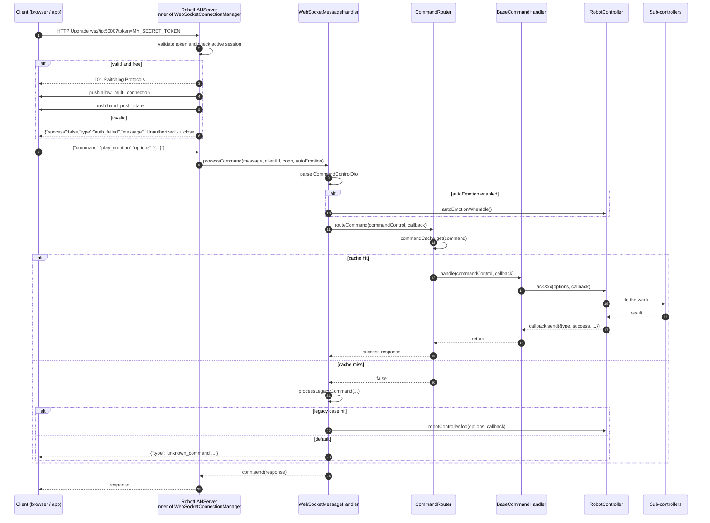
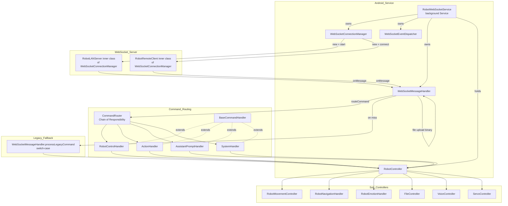
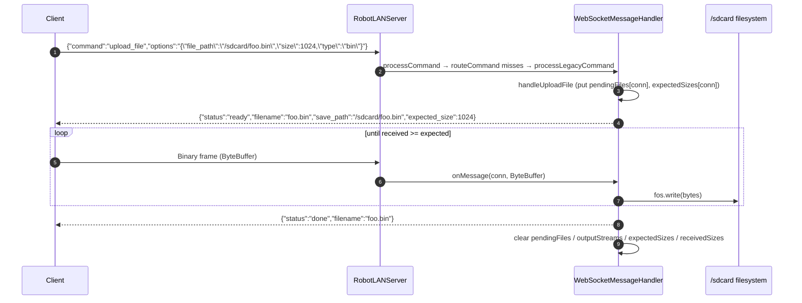
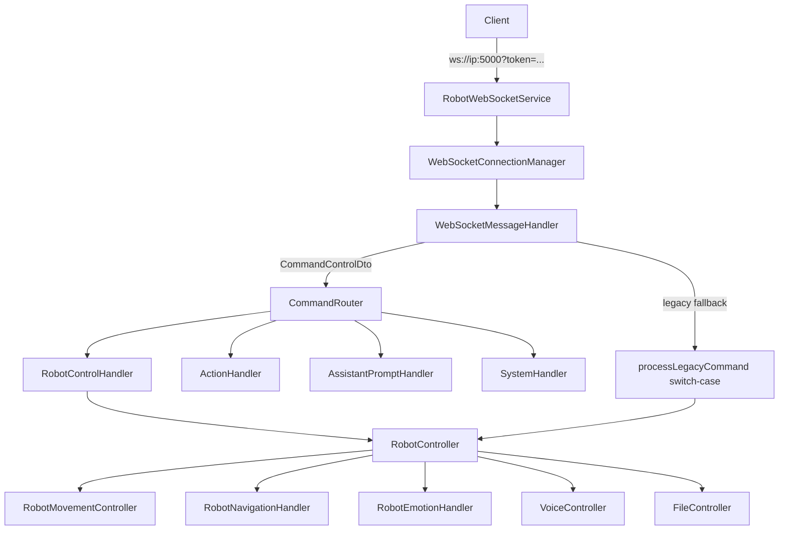

# Cruzr WebSocket Control API

> **Version:** 1.0 · **Last verified:** 2026-06-17 · **Source:** `app/src/main/java/com/sparkcore.cruzr.englishassistant.services`
>
> **Status:** 66 reachable commands (57 via `CommandRouter`, 9 via legacy fallback) — all verified against source.

---

## Table of Contents

- [1. Robot Control (22 commands)](#1-robot-control-22-commands)
     - [`stream_move_input`](#cmd-stream_move_input)
     - [`key_move_input`](#cmd-key_move_input)
     - [`play_sound_with_talk_action`](#cmd-play_sound_with_talk_action)
     - [`voice_list`](#cmd-voice_list)
     - [`hand_push`](#cmd-hand_push)
     - [`hand_push_state`](#cmd-hand_push_state)
     - [`current_location`](#cmd-current_location)
     - [`maps`](#cmd-maps)
     - [`use_map`](#cmd-use_map)
     - [`current_map`](#cmd-current_map)
     - [`locate_self`](#cmd-locate_self)
     - [`locate`](#cmd-locate)
     - [`navigate`](#cmd-navigate)
     - [`dances`](#cmd-dances)
     - [`play_dance`](#cmd-play_dance)
     - [`play_emotion`](#cmd-play_emotion)
     - [`emotions`](#cmd-emotions)
     - [`emotion_icon`](#cmd-emotion_icon)
     - [`dismiss_emotion`](#cmd-dismiss_emotion)
     - [`volume`](#cmd-volume)
     - [`set_volume`](#cmd-set_volume)
     - [`shutdown`](#cmd-shutdown)
- [2. Action Management (7 commands)](#2-action-management-7-commands)
     - [`get_actions`](#cmd-get_actions)
     - [`get_action`](#cmd-get_action)
     - [`create_action`](#cmd-create_action)
     - [`update_action`](#cmd-update_action)
     - [`delete_action`](#cmd-delete_action)
     - [`execute_action`](#cmd-execute_action)
     - [`create_default_actions`](#cmd-create_default_actions)
- [3. Assistant Prompts (10 commands)](#3-assistant-prompts-10-commands)
     - [`get_assistant_prompts`](#cmd-get_assistant_prompts)
     - [`get_assistant_prompt`](#cmd-get_assistant_prompt)
     - [`create_assistant_prompt`](#cmd-create_assistant_prompt)
     - [`update_assistant_prompt`](#cmd-update_assistant_prompt)
     - [`delete_assistant_prompt`](#cmd-delete_assistant_prompt)
     - [`set_default_assistant_prompt`](#cmd-set_default_assistant_prompt)
     - [`search_assistant_prompts`](#cmd-search_assistant_prompts)
     - [`get_assistant_prompt_categories`](#cmd-get_assistant_prompt_categories)
     - [`get_assistant_prompt_statistics`](#cmd-get_assistant_prompt_statistics)
     - [`reset_assistant_prompts_database`](#cmd-reset_assistant_prompts_database)
- [4. System / File / Voice / Toggles (13 declared, 12 functional)](#4-system-file-voice-toggles-13-declared-12-functional)
     - [`get_file`](#cmd-get_file)
     - [`list_files`](#cmd-list_files)
     - [`upload_file`](#cmd-upload_file)
     - [`get_voices_streaming`](#cmd-get_voices_streaming)
     - [`play_voice_response`](#cmd-play_voice_response)
     - [`get_system_prompt`](#cmd-get_system_prompt)
     - [`set_system_prompt`](#cmd-set_system_prompt)
     - [`reset_system_prompt`](#cmd-reset_system_prompt)
     - [`toggle_allow_multi_connection`](#cmd-toggle_allow_multi_connection)
     - [`allow_multi_connection`](#cmd-allow_multi_connection)
     - [`toggle_auto_emotion`](#cmd-toggle_auto_emotion)
     - [`allow_auto_emotion`](#cmd-allow_auto_emotion)
     - [`set_auto_emotion`](#cmd-set_auto_emotion)
- [5. Legacy Fallback (9 commands)](#5-legacy-fallback-9-commands)
     - [`open_ui`](#cmd-open_ui)
     - [`open_activity`](#cmd-open_activity)
     - [`lock_emotion`](#cmd-lock_emotion)
     - [`toggle_lock_emotion`](#cmd-toggle_lock_emotion)
     - [`servo_list`](#cmd-servo_list)
     - [`set_servo_angle`](#cmd-set_servo_angle)
     - [`mcp_info`](#cmd-mcp_info)
     - [`actions`](#cmd-actions)
     - [`play_action`](#cmd-play_action)
- [Push Events](#push-events)
- [Error Handling](#error-handling)
- [Preferences Reference](#preferences-reference)
- [Code Map](#code-map)
- [Resolved Items](#todo-verify-resolved-items)

---

## Overview

The Android app acts as a **WebSocket server** (`RobotLANServer`, inner class of `WebSocketConnectionManager`)
on the robot's LAN. Clients connect via `ws://ip:5000?token=MY_SECRET_TOKEN` to send commands and receive
responses or push events. A second mode — a **remote client** (`RobotRemoteClient`) connecting outbound to
`ws://your-provider-ip:8081` — exists but is inactive (placeholder URL, not wired in the production build).

**Command routing:** incoming messages go through `WebSocketMessageHandler.processCommand`, which delegates
to `CommandRouter` (Chain of Responsibility pattern, 4 handlers). If no handler claims the command, it falls
back to `WebSocketMessageHandler.processLegacyCommand()` (switch-case, 9 live branches).

### Architecture — Sequence Diagram



### Architecture — Class Wiring



---

## Connection

### URL

```
ws://{robot-ip}:{port}?token={token}
```

| Parameter | Default           | Source                                                                                                                                                                            |
| --------- | ----------------- | --------------------------------------------------------------------------------------------------------------------------------------------------------------------------------- |
| IP        | Robot LAN IP      | Device network                                                                                                                                                                    |
| Port      | `5000`            | `WebSocketConnectionManager.java:50-51`, `WebSocketConfig.java:22`. Read from SharedPreference `websocket_service_port`, out-of-range values (<1024 or >65535) revert to default. |
| Token     | `MY_SECRET_TOKEN` | Hard-coded in `WebSocketConnectionManager.java:53`, `WebSocketConfig.java:21`, `RobotLANServer.java:100`. **NOT a SharedPreferences value.**                                      |

### Authentication

Token is validated from the WebSocket handshake query string (`WebSocketConnectionManager.java:294-313`).

- **Bad token:** server sends `{"success":false,"type":"auth_failed","message":"Unauthorized"}` and closes.
- **Session busy (multi-connection disabled):** server sends `{"success":false,"type":"auth_failed","message":"Have session connected"}` and closes.

> Both auth failures use the same JSON shape (`{success:false, type:"auth_failed", message:"..."}`) so clients only need one error parser. Distinguish by the `message` field.

### Multi-connection Mode

Controlled by SharedPreference `allow_multi_connection` (default: `false`).

- When `false`: only one client connected at a time. New connections while a session is active get `auth_failed`.
- When `true`: multiple LAN clients may be connected simultaneously.

Toggle via `toggle_allow_multi_connection` command (broadcasts state to all).

### Auto-emotion

Controlled by SharedPreference `enable_auto_emotion` (default: `false`).

When enabled, the server calls `robotController.autoEmotionWhenIdle()` on every command. Toggle via `toggle_auto_emotion` command.

### Reconnection

On disconnect, implement exponential backoff reconnection. Server does not persist session state between connections — all state is in-memory.

### Connection Examples

**Python (websocket-client):**

```python
import websocket

ws = websocket.WebSocket()
ws.connect("ws://ROBOT_IP:5000?token=MY_SECRET_TOKEN")

# Send command
ws.send('{"command": "volume", "options": ""}')

# Receive response
response = ws.recv()
print(response)  # {"type":"volume","data":{"volume":7,"minVolume":0,"maxVolume":15}}

ws.close()
```

**JavaScript (browser WebSocket):**

```javascript
const ws = new WebSocket("ws://ROBOT_IP:5000?token=MY_SECRET_TOKEN");

ws.onopen = () => {
ws.send(JSON.stringify({ command: "dances", options: "" }));
};

ws.onmessage = (event) => {
const msg = JSON.parse(event.data);
console.log(msg); // { type: "dances", success: true, data: [{path, name}, ...] }
};

ws.onclose = () => console.log("disconnected");
```

**curl (WebSocket upgrade check only — no full duplex over curl):**

```bash
# Run a single WebSocket upgrade handshake to verify connectivity/auth.
# curl cannot maintain a full duplex WebSocket session; this only checks
# that the server returns 101 Switching Protocols.
curl -i -N \
  -H "Connection: Upgrade" \
  -H "Upgrade: websocket" \
  -H "Sec-WebSocket-Version: 13" \
  -H "Sec-WebSocket-Key: dGhlIHNhbXBsZSBub25jZQ==" \
  "ws://ROBOT_IP:5000?token=MY_SECRET_TOKEN"
```

Sample successful response:

```
HTTP/1.1 101 Switching Protocols
Connection: Upgrade
Sec-WebSocket-Accept: s3pPLMBiTxaQ9kYGzzhZRbK+xOo=
Upgrade: websocket
```

Sample auth failure (the WebSocket handshake completes first; auth is enforced immediately after as a JSON message, then the connection is closed by the server):

```json
{
  "success": false,
  "type": "auth_failed",
  "message": "Unauthorized"
}
```

> **Note:** Unlike HTTP APIs, the auth check happens *after* the WebSocket upgrade completes. The server sends the JSON above as a WebSocket text frame, then closes the connection. Clients should treat any non-`101 Switching Protocols` response OR a WebSocket close immediately after handshake as auth failure.

---

## Message Format

### Request Schema

Defined in `CommandControlDto.java`:

```json
{
	"command": "<command_name>",
	"options": "<string-or-JSON-string>"
}
```

- `command` — **required**, string, the command identifier.
- `options` — **always a string at the transport layer**. Handlers that need structured data call `gson.fromJson(optionStr, JsonObject.class)` internally. `set_volume` is the one command where `options` is a bare integer string (`"50"`).

### Response Envelope — Success

```json
{
  "type": "<handler-specific>",
  "success": true,
  "data": { ... },
  "message": "Human-readable message"
}
```

### Response Envelope — Error

```json
{
	"type": "<type>",
	"success": false,
	"message": "Error description",
	"error_type": "ExceptionClassName"
}
```

### Push Event (server-initiated, no `success` field)

```json
{
	"type": "event_type",
	"value": true
}
```

### Upload Status (status-based, no `success` field)

```json
{ "status": "ready", "filename": "...", "save_path": "...", "expected_size": 1024 }
{ "status": "done",  "filename": "..." }
{ "status": "error", "message": "..." }
```

### Response Builders

Two utility classes exist but are used inconsistently — most handlers build `HashMap` by hand.

**`ResponseBuilder.java`:** `success(type, data)`, `success(type, data, message)`, `error(type, message)`, `error(type, exception)`, `status(type, success, message)`

**`WebSocketResponse.java`:** string variants returning serialized JSON, plus `list(type, data, count)` and `ack(command, status)`.

---

## 1. Robot Control (22 commands)

Handler: `RobotControlHandler` · Category: `RobotControl`

### Command Index

| #   | Command                                                           | Description                 |
| --- | ----------------------------------------------------------------- | --------------------------- |
| 1   | [`stream_move_input`](#cmd-stream_move_input)                     | Continuous Stream Movement  |
| 2   | [`key_move_input`](#cmd-key_move_input)                           | Locomotion Options          |
| 3   | [`play_sound_with_talk_action`](#cmd-play_sound_with_talk_action) | Play Sound with Talk Action |
| 4   | [`voice_list`](#cmd-voice_list)                                   | List Voice Files            |
| 5   | [`hand_push`](#cmd-hand_push)                                     | Toggle Hand Push Mode       |
| 6   | [`hand_push_state`](#cmd-hand_push_state)                         | Get Hand Push State         |
| 7   | [`current_location`](#cmd-current_location)                       | Get Current Location        |
| 8   | [`maps`](#cmd-maps)                                               | Get Maps List               |
| 9   | [`use_map`](#cmd-use_map)                                         | Load and Use Map            |
| 10  | [`current_map`](#cmd-current_map)                                 | Get Current Map             |
| 11  | [`locate_self`](#cmd-locate_self)                                 | Locate Robot on Map         |
| 12  | [`locate`](#cmd-locate)                                           | Set Robot Position          |
| 13  | [`navigate`](#cmd-navigate)                                       | Navigate to Target          |
| 14  | [`dances`](#cmd-dances)                                           | Get Dances List             |
| 15  | [`play_dance`](#cmd-play_dance)                                   | Play Dance Animation        |
| 16  | [`play_emotion`](#cmd-play_emotion)                               | Play Emotion Animation      |
| 17  | [`emotions`](#cmd-emotions)                                       | Get Emotions List           |
| 18  | [`emotion_icon`](#cmd-emotion_icon)                               | Get Emotion Icon            |
| 19  | [`dismiss_emotion`](#cmd-dismiss_emotion)                         | Dismiss Current Emotion     |
| 20  | [`volume`](#cmd-volume)                                           | Get Current Volume          |
| 21  | [`set_volume`](#cmd-set_volume)                                   | Set Volume                  |
| 22  | [`shutdown`](#cmd-shutdown)                                       | Shutdown Robot              |

---

### 1. `stream_move_input` — Continuous Stream Movement

<a id="cmd-stream_move_input"></a>

Send real-time locomotion commands. The robot moves while commands arrive; stops on `stop` or disconnect.

**Options (MoveDto):**

| Field          | Type   | Required | Description                                                                                                               |
| -------------- | ------ | -------- | ------------------------------------------------------------------------------------------------------------------------- |
| `action`       | string | Yes      | `move_forward` \| `move_forward_left` \| `move_forward_right` \| `move_back` \| `rotate_left` \| `rotate_right` \| `stop` |
| `movingSpeed`  | float  | No       | Forward/back speed                                                                                                        |
| `turningSpeed` | float  | No       | Rotation speed                                                                                                            |

**Response type:** derived — `callback.result("Action Run Done")` returns a raw string, no `type` envelope.

**Source:** `RobotControlHandler.java:39-41`, `RobotMovementController.java:139-228`

**Example request:**

```json
{
	"command": "stream_move_input",
	"options": "{\"action\":\"move_forward\",\"movingSpeed\":0.5,\"turningSpeed\":0.3}"
}
```

**Example response:**

```json
{ "type": "stream_move_input", "success": true, "data": "Action Run Done" }
```

---

### 2. `key_move_input` — Locomotion Options

<a id="cmd-key_move_input"></a>

Sends a locomotion command with fine-grained parameters. Despite the name, does NOT read W/A/S/D keys.

**Options (LocomotionOptionDTO):**

| Field          | Type  | Required | Description         |
| -------------- | ----- | -------- | ------------------- |
| `duration`     | int   | No       | Duration in ms      |
| `isEmergency`  | bool  | No       | Emergency stop flag |
| `turningAxis`  | float | No       | Turning axis value  |
| `movingAngle`  | float | No       | Movement angle      |
| `turningSpeed` | float | No       | Turning speed       |
| `movingSpeed`  | float | No       | Movement speed      |

**Response type:** derived — no `type` set; resolves via `callback.result(...)`.

**Source:** `RobotControlHandler.java:42-44`, `RobotMovementController.java:230+`, `data/LocomotionOptionDTO.java`

**Example request:**

```json
{
	"command": "key_move_input",
	"options": "{\"duration\":2000,\"movingSpeed\":0.6,\"turningSpeed\":0.0}"
}
```

**Example response:**

```json
{ "type": "key_move_input", "data": "run successful" }
```

---

### 3. `play_sound_with_talk_action` — Play Sound with Talk Action

<a id="cmd-play_sound_with_talk_action"></a>

Play a sound file paired with a talk/gesture animation.

**Options (PlaySoundWithTalkActionDto):**

| Field         | Type   | Required | Description            |
| ------------- | ------ | -------- | ---------------------- |
| `path`        | string | **Yes**  | File path of the sound |
| `talkingType` | string | No       | Talking type enum      |
| `actions`     | array  | No       | List of action strings |
| `occuptation` | bool   | No       | Occupancy flag         |

**Response type:** derived — `playSound()` in `VoiceController` does not set a `type`.

**Source:** `RobotControlHandler.java:47-49`, `VoiceController.java:124,240`, `data/control/PlaySoundWithTalkActionDto.java:22-27`

> **Note:** The old doc used `action_uri` — the real field is `path`.

**Example request:**

```json
{
	"command": "play_sound_with_talk_action",
	"options": "{\"path\":\"/sdcard/dance/voices/hello.wav\",\"talkingType\":\"normal\"}"
}
```

**Example response:**

```json
{ "type": "play_sound_with_talk_action", "success": true, "data": true }
```

---

### 4. `voice_list` — List Voice Files

<a id="cmd-voice_list"></a>

Returns the list of voice files from `/storage/emulated/0/dance/voices`.

**Options:** none (ignored)

**Response type:** `List<FileInfo>` wrapped in `data`. Each item has `name` and `size`. **Empty list is a valid response** — means the robot uses its built-in TTS engine and no custom voice packs are installed.

**Source:** `RobotControlHandler.java:50-52`, `FileController.java:50-54`

**Example request:**

```json
{ "command": "voice_list", "options": "" }
```

**Example response:**

```json
{
	"type": "voice_list",
	"success": true,
	"data": [],
	"message": ""
}
```

> **Note:** An empty `data: []` means the robot has no custom voice files. The robot tested returned an empty list; the built-in TTS engine is used as fallback. To install voices, place WAV files in `/storage/emulated/0/dance/voices/`.

---

### 5. `hand_push` — Toggle Hand Push Mode

<a id="cmd-hand_push"></a>

Toggles the `HandPushModeState` SharedPreference and broadcasts the new state.

**Options:** none

**Response type:** `hand_push` with `value: "on"|"off"` (legacy format — uses `value` instead of `data`)

**Source:** `RobotControlHandler.java:55-57`, `RobotMovementController.java:99-122`

**Example request:**

```json
{ "command": "hand_push", "options": "" }
```

**Example response:**

```json
{ "type": "hand_push", "value": "on" }
```

---

### 6. `hand_push_state` — Get Hand Push State

<a id="cmd-hand_push_state"></a>

Returns the current hand-push mode. Sent on connect and on toggle (broadcast via `resultAll`).

**Options:** none

**Response type:** `hand_push` with `value: <bool>` (broadcast)

**Source:** `RobotControlHandler.java:58-60`, `RobotMovementController.java:125-136`

**Example request:**

```json
{ "command": "hand_push_state", "options": "" }
```

**Example response:**

```json
{ "type": "hand_push", "value": true }
```

---

### 7. `current_location` — Get Current Location

<a id="cmd-current_location"></a>

Returns the robot's current position on the map.

**Options:** none

> **Confirmed:** The handler delegates to `RobotNavigationHandler.getCurrentLocation()`, which calls `navigationService.calculateRobotLocation(currentLocation)` and returns the result via `callback.result(...)`. The response shape depends on the navigation service implementation. The push-event variant uses type `current_location` (see `RobotNavigationHandler.java:302,340` via `lanNotifier.sendSuccess`).

**Source:** `RobotControlHandler.java:63-65`, `RobotController.java:186`

**Example request:**

```json
{ "command": "current_location", "options": "" }
```

**Example response:**

```json
{
	"type": "current_location",
	"success": true,
	"data": { "x": 150.0, "y": 230.0, "yaw": 90.0 }
}
```

---

### 8. `maps` — Get Maps List

<a id="cmd-maps"></a>

Retrieve all available navigation maps. Each entry is a `MapBean` with the map's geometry, overlays, markers, and nav files.

**Options:** none

**Response type:** `List<MapBean>` wrapped in `data`. Each item has:

- `id` (string) — 32-char hex map identifier (use this for `use_map.map_id`)
- `name` (string) — Display name (e.g. `"nha_f"`, `"AdvanceRoom"`)
- `scale` (double) — Map scale (e.g. `0.05`)
- `extension.content` (string) — JSON metadata string, e.g. `{"isCruiserRandom":true}`
- `navFile.uriString` (string) — Local nav file URI: `file:///storage/emulated/0/UBT_Map/<name>/<hash>.gz`
- `navFileUrl` (string) — FTP URL to fetch the nav file (port 8088 by default)
- `groundOverlayList[]` — Array of map overlays (e.g. rail images) with `imageUrl`, `width`, `height`, `originInImage.{x,y}`, `type`
- `markerList[]` — Array of named positions with `title`, `position.{x,y}`, `tagList[]`, and `extension.content` (JSON: `point_name`, `point_type`, `map_x`, `map_y`, `theta`)
- `polylineList[]` — Array of polylines (paths on the map)

**Source:** `RobotControlHandler.java:66-68`, `RobotController.java:166`

**Example request:**

```json
{ "command": "maps", "options": "" }
```

**Example response:**

```json
{
  "type": "maps",
  "success": true,
  "data": [
    {
      // Map 1 — nha_f: 1 ground overlay, no markers
      "extension": {"content": "{"isCruiserRandom":true}"},
      "groundOverlayList": [
        {
          "image": {"uriString": "file:///storage/emulated/0/UBT_Map/nha_f/6dad2a6839702b2cf71b3e991abdb28a.png"},
          "imageUrl": "ftp://FTP_SERVER:8088/FTP/6dad2a6839702b2cf71b3e991abdb28a.png",
          "name": "rail",
          "originInImage": {"x": -425.0, "y": 370.0},
          "type": "no_rail",
          "width": 832,
          "height": 1216
        }
      ],
      "id": "1dbbcf6d701996c038233d2ae10876ea",
      "markerList": [],
      "name": "nha_f",
      "navFile": {"uriString": "file:///storage/emulated/0/UBT_Map/nha_f/24a64f90538cca3768a4c59ae0584cbc.gz"},
      "navFileUrl": "ftp://FTP_SERVER:8088/FTP/24a64f90538cca3768a4c59ae0584cbc.gz",
      "polylineList": [],
      "scale": 0.05
    },
    {
      // Map 2 — AdvanceRoom: 1 overlay, 2 markers
      "extension": {"content": "{"isCruiserRandom":true}"},
      "groundOverlayList": [
        {
          "image": {"uriString": "file:///storage/emulated/0/UBT_Map/AdvanceRoom/4a70c4fce7a1660332246e692fc2afe4.png"},
          "imageUrl": "ftp://FTP_SERVER:8088/FTP/4a70c4fce7a1660332246e692fc2afe4.png",
          "name": "rail",
          "originInImage": {"x": -222.0, "y": 174.0},
          "type": "rail",
          "width": 416,
          "height": 288
        }
      ],
      "id": "b738c0c607a207eb193c0cedae9af2e4",
      "markerList": [
        {
          "description": "",
          "extension": {"content": "{"point_name":"One","point_type":"normal_position","map_x":"5.2243","map_y":"-1.0784","theta":"0"}"},
          "id": "06c2cea18679d64399783748fa367bdd",
          "tagList": ["normal_position"],
          "title": "One",
          "position": {"x": 326.4853, "y": 195.5687},
          "rotation": 0.0,
          "z": 0.0
        }
        // ... marker "Two" with same shape
      ],
      "name": "AdvanceRoom",
      "navFile": {"uriString": "file:///storage/emulated/0/UBT_Map/AdvanceRoom/...gz"},
      "navFileUrl": "ftp://FTP_SERVER:8088/FTP/...gz",
      "polylineList": [],
      "scale": 0.05
    }
  ],
  "message": ""
}
```

> **Note:** Pass `data[i].id` to `use_map` (see command #9) to activate a map. The `navFile` and `image.uriString` are local paths on the robot; `navFileUrl` and `imageUrl` are FTP endpoints for syncing from the editing PC. Markers expose named positions (`title`) with map coordinates (`position.x/y`) for navigation targets.

---

### 9. `use_map` — Load and Use Map

<a id="cmd-use_map"></a>

Load and activate a specific navigation map.

**Options:**

| Field    | Type   | Required | Description    |
| -------- | ------ | -------- | -------------- |
| `map_id` | string | Yes      | Map ID to load |

**Response type:** derived

**Source:** `RobotControlHandler.java:69-71`, `RobotController.java:170`

**Example request:**

```json
{
  "command": "use_map",
  "options": "{\"map_id\":\"1dbbcf6d701996c038233d2ae10876ea\"}"
}
```

**Example response (success):**

```json
{ "type": "use_map", "success": true }
```

**Example response (failure — map file missing on disk):**

```json
{
  "type": "use_map",
  "success": false,
  "message": "set ros map failed cause by no this navMap."
}
```

> **Note:** Use the 32-char hex `id` field from the `maps` command response as `map_id`. The server returns `success: false` with a detailed `message` when the navMap's `.gz` file is not on the robot's local disk (`/storage/emulated/0/UBT_Map/<name>/<id>.gz`).

---

### 10. `current_map` — Get Current Map

<a id="cmd-current_map"></a>

Returns the currently active navigation map.

**Options:** none

**Response type:** derived

**Source:** `RobotControlHandler.java:72-74`, `RobotController.java:174`

**Example request:**

```json
{ "command": "current_map", "options": "" }
```

**Example response:**

```json
{ "type": "current_map", "success": true, "data": "map_01" }
```

---

### 11. `locate_self` — Locate Robot on Map

<a id="cmd-locate_self"></a>

Trigger SLAM self-localization on the current map.

**Options:** none

**Response type:** derived

**Source:** `RobotControlHandler.java:75-77`, `RobotController.java:178`

**Example request:**

```json
{ "command": "locate_self", "options": "" }
```

**Example response:**

```json
{ "type": "locate_self", "success": true, "data": true }
```

---

### 12. `locate` — Set Robot Position

<a id="cmd-locate"></a>

Set the robot's virtual position on the map (without physical movement).

**Options (Point):** `{x:double, y:double}` — Ubtrobot lib, 10s timeout

**Response type:** derived

**Source:** `RobotControlHandler.java:78-80`, `RobotController.java:182`, `RobotNavigationHandler.java:215`

**Example request:**

```json
{
	"command": "locate",
	"options": "{\"x\":150,\"y\":230}"
}
```

**Example response:**

```json
{ "type": "locate", "success": true, "data": true }
```

---

### 13. `navigate` — Navigate to Target

<a id="cmd-navigate"></a>

Pathfind and move the robot to a target position.

**Options:** JSON `{name, x, y, yaw?}` — passed to `RobotNavigationHandler.navigate(options, callback)`

> **Confirmed:** Response type is `navigate_task` with data `"Navigate done"`. See `RobotNavigationHandler.java:273`.

**Source:** `RobotControlHandler.java:81-83`, `RobotController.java:190`

**Example request:**

```json
{
	"command": "navigate",
	"options": "{\"name\":\"desk\",\"x\":300,\"y\":400,\"yaw\":90}"
}
```

**Example response:**

```json
{ "type": "navigate_task", "success": true, "data": "Navigate done" }
```

---

### 14. `dances` — Get Dances List

<a id="cmd-dances"></a>

Retrieve all available dance animations (built-in + user-installed).

**Options:** none

**Response type:** `List<DancerBean>` wrapped in `data`. Each item has:

- `name` (string) — Display name
- `uri` (string) — Reference URI for `play_dance`. Two schemes:
     - `orchestration://id/<name>` — built-in dance (e.g. `"orchestration://id/Dura"`)
     - `file:///storage/emulated/0/dance/configfile/<name>.json` — user-installed JSON config
- `extension` (object) — Optional metadata: `{icon: "p1", tts: ""}`. `icon` is the category (`p1`=pop, `p3`=folk); `tts` is the spoken name (empty if no TTS recorded).

**Source:** `RobotControlHandler.java:86-88`, `RobotMovementController.java:280+`

**Example request:**

```json
{ "command": "dances", "options": "" }
```

**Example response:**

```json
{
	"type": "dances",
	"success": true,
	"data": [
		// Built-in dance — uses orchestration://id/ scheme
		{
			"extension": { "tts": "" },
			"name": "Dura",
			"uri": "orchestration://id/Dura"
		},
		// User-installed dance — uses file:// scheme
		{
			"extension": { "icon": "p1", "tts": "" },
			"name": "HaoKhiVietNam",
			"uri": "file:///storage/emulated/0/dance/configfile/HaoKhiVietNam.json"
		}
	],
	"message": ""
}
```

> **Note:** The response array contains both built-in and user-installed dances. Pass the `uri` field directly to `play_dance` (see command #15). The robot tested returned 25 items total.

---

### 15. `play_dance` — Play Dance Animation

<a id="cmd-play_dance"></a>

Trigger a specific dance animation.

**Options (PlayDto):** `{path REQ}` — string path to dance JSON file

**Response type:** derived — `orchestrationManager.play(Uri.parse(path))` → `callback.result(true)`

**Source:** `RobotControlHandler.java:89-91`, `RobotMovementController.java:314`

**Example request:**

```json
{
	"command": "play_dance",
	"options": "{\"path\":\"/sdcard/dance/dance_001.json\"}"
}
```

**Example response:**

```json
{ "type": "play_dance", "success": true, "data": true }
```

---

### 16. `play_emotion` — Play Emotion Animation

<a id="cmd-play_emotion"></a>

Trigger a specific emotion animation.

**Options:**

| Field      | Type   | Required | Description      |
| ---------- | ------ | -------- | ---------------- |
| `emotion`  | string | Yes      | Emotion name     |
| `priority` | int    | No       | Display priority |

**Response type:** derived

**Source:** `RobotControlHandler.java:92-94`, `RobotController.java:141`

**Example request:**

```json
{
	"command": "play_emotion",
	"options": "{\"emotion\":\"happy\",\"priority\":10}"
}
```

**Example response:**

```json
{ "type": "play_emotion", "success": true, "data": true }
```

---

### 17. `emotions` — Get Emotions List

<a id="cmd-emotions"></a>

Retrieve all available facial emotions the robot can display.

**Options:** none

**Response type:** `List<EmotionInfo>` wrapped in `data`. Each item has:

- `emotionUri` (string) — Reference URI for `play_emotion`. Scheme: `emotion://va/<name>`
- `iconUri` (string) — Path to the PNG icon for `emotion_icon`. Scheme: `emotion/icon/<name>.png`

**Source:** `RobotControlHandler.java:95-97`, `RobotController.java:410`

**Example request:**

```json
{ "command": "emotions", "options": "" }
```

**Example response:**

```json
{
  "type": "emotions",
  "success": true,
  "data": [
    // Cruzr signature face — used as the default standby expression
    {
      "emotionUri": "emotion://va/techface_wronged",
      "iconUri": "emotion/icon/techface_wronged.png"
    },
    // Generic "happy" emotion — pass to play_emotion
    {
      "emotionUri": "emotion://va/techface_happy",
      "iconUri": "emotion/icon/techface_happy.png"
    },
    // Default emotion — robot returns to this when no expression is set
    {
      "emotionUri": "emotion://va/face_default",
      "iconUri": "emotion/icon/face_default.png"
    }
    // ... 22 more entries (techface_*, face_*, littlestar_*) — total 25
  ],
  "message": ""
}
```

> **Note:** Pass `emotionUri` to `play_emotion` (see command #16) and `iconUri` to `emotion_icon` (see command #18). Names follow a `<category>_<expression>` pattern: `techface_*` (Cruzr signature face), `face_*` (generic), `littlestar_*` (child mascot).

---

### 18. `emotion_icon` — Get Emotion Icon

<a id="cmd-emotion_icon"></a>

Retrieve the drawable icon for a specific emotion. Sends binary PNG data followed by a metadata HashMap.

**Options:** `options` (string) = drawable resource path (e.g. `"ic_emotion_happy.png"` in `com.ubtrobot.resources`)

**Response type:** binary frame (PNG image bytes) → then `HashMap{type:"emotion_icon", success:true, filename, size, width, height}`

**Source:** `RobotControlHandler.java:98-100`, `FileController.java:190+`

**Example request:**

```json
{
	"command": "emotion_icon",
	"options": "ic_emotion_happy.png"
}
```

**Example response (metadata after binary frame):**

```json
{
	"type": "emotion_icon",
	"success": true,
	"filename": "ic_emotion_happy.png",
	"size": 12345,
	"width": 128,
	"height": 128
}
```

---

### 19. `dismiss_emotion` — Dismiss Current Emotion

<a id="cmd-dismiss_emotion"></a>

Cancel any currently playing emotion animation.

**Options:** none

**Response type:** derived

**Source:** `RobotControlHandler.java:101-103`, `RobotController.java:137`

**Example request:**

```json
{ "command": "dismiss_emotion", "options": "" }
```

**Example response:**

```json
{ "type": "dismiss_emotion", "success": true, "data": true }
```

---

### 20. `volume` — Get Current Volume

<a id="cmd-volume"></a>

Query the robot's current volume level.

**Options:** none

**Response type:** `HashMap` with `type: "volume"` and nested `data` containing `volume`, `minVolume`, `maxVolume`

**Source:** `RobotControlHandler.java:106-108`, `VoiceController.java:90-104`

> **Note:** Volume range is `[0, 15]`. The `maxVolume` field is capped at 15 for Cruzr hardware safety (see `SoundController.setVolume`). The raw `AudioManager.getStreamMaxVolume()` may report a higher value; we always return the clamped ceiling to clients.

**Example request:**

```json
{ "command": "volume", "options": "" }
```

**Example response:**

```json
{
	"type": "volume",
	"data": {
		"volume": 7,
		"minVolume": 0,
		"maxVolume": 15
	}
}
```

---

### 21. `set_volume` — Set Volume

<a id="cmd-set_volume"></a>

Set the robot's volume level. Valid range: **0–15** (Cruzr hardware ceiling). Values outside this range are clamped silently — no error is returned. Response echoes the new level via the same shape as `volume`.

**Options:** plain string integer in range 0–15 — **NOT JSON** (e.g. `"10"`)

**Response type:** derived

**Source:** `RobotControlHandler.java:109-111`, `RobotController.java:202`, `VoiceController.java:107-118`

**Example request:**

```json
{
	"command": "set_volume",
	"options": "10"
}
```

**Example response:**

```json
{ "type": "set_volume", "success": true, "data": true }
```

---

### 22. `shutdown` — Shutdown Robot

<a id="cmd-shutdown"></a>

Initiate robot shutdown sequence.

**Options:** none

**Response type:** derived

**Source:** `RobotControlHandler.java:112-114`, `RobotController.java:290`

**Example request:**

```json
{ "command": "shutdown", "options": "" }
```

**Example response:**

```json
{ "type": "shutdown", "success": true, "data": true }
```

---

## 2. Action Management (7 commands)

Handler: `ActionHandler` · Category: `Actions`

### Command Index

| #   | Command                                                 | Description            |
| --- | ------------------------------------------------------- | ---------------------- |
| 1   | [`get_actions`](#cmd-get_actions)                       | Get Actions List       |
| 2   | [`get_action`](#cmd-get_action)                         | Get Specific Action    |
| 3   | [`create_action`](#cmd-create_action)                   | Create Action          |
| 4   | [`update_action`](#cmd-update_action)                   | Update Action          |
| 5   | [`delete_action`](#cmd-delete_action)                   | Delete Action          |
| 6   | [`execute_action`](#cmd-execute_action)                 | Execute Action         |
| 7   | [`create_default_actions`](#cmd-create_default_actions) | Create Default Actions |

---

Database: `ActionManager` → GreenDAO (`Action` entity)

---

### 1. `get_actions` — Get Actions List

<a id="cmd-get_actions"></a>

Retrieve managed robot actions, optionally filtered to active-only.

**Options (optional):**

| Field         | Type | Required | Description                          |
| ------------- | ---- | -------- | ------------------------------------ |
| `active_only` | bool | No       | Filter active only (default: `true`) |

**Response type:** `actions` (+ `filter: "active"|"all"`, `count`, `message`)

**Source:** `ActionHandler.java:43-45,69-98`

**Example request:**

```json
{
	"command": "get_actions",
	"options": "{\"active_only\":false}"
}
```

**Example response:**

```json
{
	"type": "actions",
	"success": true,
	"filter": "all",
	"count": 12,
	"data": [
		{
			"command": "greet",
			"name": "Greeting",
			"uri": "builtin://greet",
			"priority": 10,
			"is_active": true
		}
	],
	"message": "Actions retrieved successfully"
}
```

---

### 2. `get_action` — Get Specific Action

<a id="cmd-get_action"></a>

Retrieve a single action by its `command` identifier.

**Options:**

| Field     | Type   | Required | Description                      |
| --------- | ------ | -------- | -------------------------------- |
| `command` | string | **Yes**  | The action's unique command name |

**Response type:** `action` (+ `command`, `data`, `message`)

**Source:** `ActionHandler.java:46-48,100-119`

**Example request:**

```json
{
	"command": "get_action",
	"options": "{\"command\":\"greet\"}"
}
```

**Example response:**

```json
{
	"type": "action",
	"success": true,
	"command": "greet",
	"data": {
		"command": "greet",
		"name": "Greeting",
		"uri": "builtin://greet",
		"priority": 10,
		"is_active": true
	},
	"message": "Action retrieved successfully"
}
```

---

### 3. `create_action` — Create Action

<a id="cmd-create_action"></a>

Create a new managed action. The `command` field must be unique.

**Options:**

| Field         | Type   | Required | Description                                                            |
| ------------- | ------ | -------- | ---------------------------------------------------------------------- |
| `command`     | string | **Yes**  | Unique command identifier                                              |
| `name`        | string | **Yes**  | Human-readable name                                                    |
| `description` | string | No       | Action description                                                     |
| `uri`         | string | No       | Action URI (builtin or custom)                                         |
| `priority`    | int    | No       | Execution priority (default: 0)                                        |
| `is_active`   | bool   | No       | Enable on create (default: `false` — Java primitive `boolean` default) |

**Response type:** `create_action`

**Source:** `ActionHandler.java:49-51,121-153`

**Example request:**

```json
{
	"command": "create_action",
	"options": "{\"command\":\"custom_wave\",\"name\":\"Custom Wave\",\"description\":\"A custom waving animation\",\"uri\":\"file:///actions/custom_wave.json\",\"priority\":5,\"is_active\":true}"
}
```

**Example response:**

```json
{
	"type": "create_action",
	"success": true,
	"data": {
		"command": "custom_wave",
		"name": "Custom Wave",
		"description": "A custom waving animation",
		"uri": "file:///actions/custom_wave.json",
		"priority": 5,
		"is_active": true
	},
	"message": "Action created successfully"
}
```

---

### 4. `update_action` — Update Action

<a id="cmd-update_action"></a>

Update an existing action by its `command` identifier (partial update).

**Options:**

| Field         | Type   | Required | Description                            |
| ------------- | ------ | -------- | -------------------------------------- |
| `command`     | string | **Yes**  | Command identifier of action to update |
| `name`        | string | No       | New name                               |
| `description` | string | No       | New description                        |
| `uri`         | string | No       | New URI                                |
| `priority`    | int    | No       | New priority                           |
| `is_active`   | bool   | No       | Enable/disable                         |

**Response type:** `update_action`

**Source:** `ActionHandler.java:52-54,155-194`

**Example request:**

```json
{
	"command": "update_action",
	"options": "{\"command\":\"custom_wave\",\"priority\":15,\"is_active\":false}"
}
```

**Example response:**

```json
{
	"type": "update_action",
	"success": true,
	"data": {
		"command": "custom_wave",
		"name": "Custom Wave",
		"description": "A custom waving animation",
		"uri": "file:///actions/custom_wave.json",
		"priority": 15,
		"is_active": false
	},
	"message": "Action updated successfully"
}
```

---

### 5. `delete_action` — Delete Action

<a id="cmd-delete_action"></a>

Delete an action by its `command` identifier.

**Options:**

| Field     | Type   | Required | Description                            |
| --------- | ------ | -------- | -------------------------------------- |
| `command` | string | **Yes**  | Command identifier of action to delete |

**Response type:** `delete_action`

**Source:** `ActionHandler.java:55-57,196-227`

**Example request:**

```json
{
	"command": "delete_action",
	"options": "{\"command\":\"custom_wave\"}"
}
```

**Example response:**

```json
{
	"type": "delete_action",
	"success": true,
	"command": "custom_wave",
	"message": "Action deleted successfully"
}
```

---

### 6. `execute_action` — Execute Action

<a id="cmd-execute_action"></a>

Execute a managed action by `command`. Eight built-in emotion commands (`greet`, `handshake`, `bow`, `wave`, `explain`, `point`, `thumbs_up`, `clap`) are internally routed to `playEmotion`. All others get a generic success payload.

**Options:**

| Field     | Type   | Required | Description                             |
| --------- | ------ | -------- | --------------------------------------- |
| `command` | string | **Yes**  | Command identifier of action to execute |

**Response type:** `execute_action` (or delegates to `play_emotion` for builtins)

**Source:** `ActionHandler.java:58-60,229-291`

**Example request:**

```json
{
	"command": "execute_action",
	"options": "{\"command\":\"greet\"}"
}
```

**Example response (custom action):**

```json
{
	"type": "execute_action",
	"success": true,
	"command": "custom_wave",
	"action": {
		"command": "custom_wave",
		"name": "Custom Wave",
		"uri": "file:///actions/custom_wave.json",
		"priority": 5,
		"is_active": true
	},
	"message": "Action executed: Custom Wave"
}
```

**Example response (builtin emotion — delegates to `playEmotion`):**

```json
{
	"type": "play_emotion",
	"success": true,
	"emotion": "greet",
	"message": "Emotion executed successfully"
}
```

---

### 7. `create_default_actions` — Create Default Actions

<a id="cmd-create_default_actions"></a>

Seed the database with the default set of actions. No options needed.

**Options:** none

**Response type:** `create_default_actions` (+ `data`, `count`)

**Source:** `ActionHandler.java:61-63,293-314`

**Example request:**

```json
{ "command": "create_default_actions", "options": "" }
```

**Example response:**

```json
{
	"type": "create_default_actions",
	"success": true,
	"data": [
		{
			"command": "greet",
			"name": "Greeting",
			"uri": "builtin://greet",
			"priority": 10,
			"is_active": true
		},
		{
			"command": "wave",
			"name": "Wave",
			"uri": "builtin://wave",
			"priority": 10,
			"is_active": true
		}
	],
	"count": 8,
	"message": "Default actions created successfully"
}
```

---

## 3. Assistant Prompts (10 commands)

Handler: `AssistantPromptHandler` · Category: `AssistantPrompts`

### Command Index

| #   | Command                                                                     | Description         |
| --- | --------------------------------------------------------------------------- | ------------------- |
| 1   | [`get_assistant_prompts`](#cmd-get_assistant_prompts)                       | Get Prompts List    |
| 2   | [`get_assistant_prompt`](#cmd-get_assistant_prompt)                         | Get Specific Prompt |
| 3   | [`create_assistant_prompt`](#cmd-create_assistant_prompt)                   | Create Prompt       |
| 4   | [`update_assistant_prompt`](#cmd-update_assistant_prompt)                   | Update Prompt       |
| 5   | [`delete_assistant_prompt`](#cmd-delete_assistant_prompt)                   | Delete Prompt       |
| 6   | [`set_default_assistant_prompt`](#cmd-set_default_assistant_prompt)         | Set Default Prompt  |
| 7   | [`search_assistant_prompts`](#cmd-search_assistant_prompts)                 | Search Prompts      |
| 8   | [`get_assistant_prompt_categories`](#cmd-get_assistant_prompt_categories)   | Get Categories      |
| 9   | [`get_assistant_prompt_statistics`](#cmd-get_assistant_prompt_statistics)   | Get Statistics      |
| 10  | [`reset_assistant_prompts_database`](#cmd-reset_assistant_prompts_database) | Reset Database      |

---

### 1. `get_assistant_prompts` — Get Prompts List

<a id="cmd-get_assistant_prompts"></a>

Retrieve assistant prompts with optional filtering.

**Options (optional):**

| Field         | Type   | Required | Description        |
| ------------- | ------ | -------- | ------------------ |
| `active_only` | bool   | No       | Filter active only |
| `category`    | string | No       | Filter by category |

**Response type:** `assistant_prompts` (+ `filter`, `data`, `count`, `message`)

Three filter modes: `category`, `active`, `all`.

**Source:** `AssistantPromptHandler.java:46-48,81-155`

**Example request:**

```json
{
	"command": "get_assistant_prompts",
	"options": "{\"active_only\":true}"
}
```

**Example response:**

```json
{
	"type": "assistant_prompts",
	"success": true,
	"filter": "active",
	"data": [
		{
			"assistant_name": "receptionist",
			"displayName": "Receptionist Bot",
			"role": "Customer service",
			"language": "vi",
			"isActive": true,
			"isDefault": false
		}
	],
	"count": 3,
	"message": "Active assistant prompts retrieved successfully"
}
```

---

### 2. `get_assistant_prompt` — Get Specific Prompt

<a id="cmd-get_assistant_prompt"></a>

Retrieve a single prompt by `id`, `name`, or `default: true`.

**Options (one of):**

| Field     | Type   | Required | Description                          |
| --------- | ------ | -------- | ------------------------------------ |
| `id`      | int    | No       | Prompt ID                            |
| `name`    | string | No       | Prompt name                          |
| `default` | bool   | No       | Set `true` to get the default prompt |

**Response type:** `assistant_prompt` (+ `lookup_type`, `identifier`, `data`, `message`)

**Source:** `AssistantPromptHandler.java:49-51,157-198`

> **Confirmed (known issue):** The `id` branch sets `identifier` and `type = "id"` but never calls `assistantPromptManager.getPromptById(...)`. The variable `result` stays `null`, so the response emits `success: false`. The `name` and `default` branches work correctly. This appears to be a missing implementation in the handler.

**Example request:**

```json
{
	"command": "get_assistant_prompt",
	"options": "{\"default\":true}"
}
```

**Example response:**

```json
{
	"type": "assistant_prompt",
	"success": true,
	"lookup_type": "default",
	"identifier": "",
	"data": {
		"assistant_name": "receptionist",
		"displayName": "Receptionist Bot",
		"role": "Customer service",
		"language": "vi",
		"isActive": true,
		"isDefault": true
	},
	"message": "Assistant prompt retrieved successfully"
}
```

---

### 3. `create_assistant_prompt` — Create Prompt

<a id="cmd-create_assistant_prompt"></a>

Create a new assistant prompt.

**Options:**

| Field               | Type   | Required | Description                             |
| ------------------- | ------ | -------- | --------------------------------------- |
| `assistant_name`    | string | **Yes**  | Unique assistant name                   |
| `display_name`      | string | **Yes**  | Display name                            |
| `role`              | string | **Yes**  | Role description                        |
| `language`          | string | No       | Language code (default: `"vi"`)         |
| `personality`       | string | No       | Personality traits                      |
| `context`           | string | No       | Context description                     |
| `tone`              | string | No       | Communication tone                      |
| `main_goal`         | string | No       | Primary objective                       |
| `sub_goal`          | string | No       | Secondary objective                     |
| `organization_name` | string | No       | Organization name                       |
| `actions`           | string | No       | JSON-string of actions (migrated to DB) |
| `role_description`  | string | No       | Detailed role                           |
| `main_functions`    | string | No       | Main functions                          |
| `tasks`             | string | No       | Task list                               |
| `audience`          | string | No       | Target audience                         |
| `long_term_goals`   | string | No       | Long-term objectives                    |
| `structure`         | string | No       | Structure definition                    |
| `social_role`       | string | No       | Social role                             |
| `category`          | string | No       | Category                                |
| `priority`          | int    | No       | Priority                                |
| `is_active`         | bool   | No       | Enable on create                        |

**Response type:** `create_assistant_prompt` (+ `id`, `data`, `message`)

**Source:** `AssistantPromptHandler.java:52-54,200-259`

**Example request:**

```json
{
	"command": "create_assistant_prompt",
	"options": "{\"assistant_name\":\"receptionist\",\"display_name\":\"Receptionist Bot\",\"role\":\"Customer service\",\"language\":\"vi\"}"
}
```

**Example response:**

```json
{
	"type": "create_assistant_prompt",
	"success": true,
	"id": 1,
	"data": {
		"assistant_name": "receptionist",
		"displayName": "Receptionist Bot",
		"role": "Customer service",
		"language": "vi",
		"isActive": false,
		"isDefault": false
	},
	"message": "Assistant prompt created successfully"
}
```

---

### 4. `update_assistant_prompt` — Update Prompt

<a id="cmd-update_assistant_prompt"></a>

Update an existing assistant prompt. Identified by `assistant_name`.

**Options:**

| Field                | Type   | Required | Description                              |
| -------------------- | ------ | -------- | ---------------------------------------- |
| `assistant_name`     | string | **Yes**  | Identifier of prompt to update           |
| _(all other fields)_ | —      | No       | Same fields as `create_assistant_prompt` |

**Response type:** `update_assistant_prompt`

**Source:** `AssistantPromptHandler.java:55-57,261-328`

**Example request:**

```json
{
	"command": "update_assistant_prompt",
	"options": "{\"assistant_name\":\"receptionist\",\"tone\":\"friendly\"}"
}
```

**Example response:**

```json
{
	"type": "update_assistant_prompt",
	"success": true,
	"data": {
		"assistant_name": "receptionist",
		"displayName": "Receptionist Bot",
		"role": "Customer service",
		"language": "vi",
		"tone": "friendly",
		"isActive": true,
		"isDefault": false
	},
	"message": "Assistant prompt updated successfully"
}
```

---

### 5. `delete_assistant_prompt` — Delete Prompt

<a id="cmd-delete_assistant_prompt"></a>

Delete an assistant prompt by `assistant_name`. **Refuses to delete the default prompt.**

**Options:**

| Field            | Type   | Required | Description                    |
| ---------------- | ------ | -------- | ------------------------------ |
| `assistant_name` | string | **Yes**  | Identifier of prompt to delete |

**Response type:** `delete_assistant_prompt`

**Source:** `AssistantPromptHandler.java:58-60,330-379`

**Example request:**

```json
{
	"command": "delete_assistant_prompt",
	"options": "{\"assistant_name\":\"receptionist\"}"
}
```

**Example response:**

```json
{
	"type": "delete_assistant_prompt",
	"success": true,
	"assistant_name": "receptionist",
	"message": "Assistant prompt deleted successfully"
}
```

---

### 6. `set_default_assistant_prompt` — Set Default Prompt

<a id="cmd-set_default_assistant_prompt"></a>

Set a prompt as the default by `assistant_name`.

**Options:**

| Field            | Type   | Required | Description                            |
| ---------------- | ------ | -------- | -------------------------------------- |
| `assistant_name` | string | **Yes**  | Identifier of prompt to set as default |

**Response type:** `set_default_assistant_prompt`

**Source:** `AssistantPromptHandler.java:61-63,381-420`

**Example request:**

```json
{
	"command": "set_default_assistant_prompt",
	"options": "{\"assistant_name\":\"receptionist\"}"
}
```

**Example response:**

```json
{
	"type": "set_default_assistant_prompt",
	"success": true,
	"assistant_name": "receptionist",
	"data": {
		"assistant_name": "receptionist",
		"displayName": "Receptionist Bot",
		"role": "Customer service",
		"language": "vi",
		"isDefault": true
	},
	"message": "Assistant prompt set as default successfully"
}
```

---

### 7. `search_assistant_prompts` — Search Prompts

<a id="cmd-search_assistant_prompts"></a>

Full-text search across prompts.

**Options:**

| Field   | Type   | Required | Description  |
| ------- | ------ | -------- | ------------ |
| `query` | string | **Yes**  | Search query |

**Response type:** `search_assistant_prompts` (+ `query`, `data`, `count`)

**Source:** `AssistantPromptHandler.java:64-66,422-450`

**Example request:**

```json
{
	"command": "search_assistant_prompts",
	"options": "{\"query\":\"receptionist\"}"
}
```

**Example response:**

```json
{
	"type": "search_assistant_prompts",
	"success": true,
	"query": "receptionist",
	"data": [
		{
			"assistant_name": "receptionist",
			"displayName": "Receptionist Bot",
			"role": "Customer service",
			"language": "vi",
			"isActive": true
		}
	],
	"count": 1,
	"message": "Search completed successfully"
}
```

---

### 8. `get_assistant_prompt_categories` — Get Categories

<a id="cmd-get_assistant_prompt_categories"></a>

Retrieve all prompt categories.

**Options:** none

**Response type:** `assistant_prompt_categories` (+ `data`, `count`)

**Source:** `AssistantPromptHandler.java:67-69,452-471`

**Example request:**

```json
{ "command": "get_assistant_prompt_categories", "options": "" }
```

**Example response:**

```json
{
	"type": "assistant_prompt_categories",
	"success": true,
	"data": ["customer_service", "education", "entertainment"],
	"count": 3,
	"message": "Assistant prompt categories retrieved successfully"
}
```

---

### 9. `get_assistant_prompt_statistics` — Get Statistics

<a id="cmd-get_assistant_prompt_statistics"></a>

Retrieve prompt usage statistics.

**Options:** none

**Response type:** `assistant_prompt_statistics` (+ `data: {total_prompts, active_prompts, default_prompts, total_usage, category_count}`)

**Source:** `AssistantPromptHandler.java:70-72,473-510`

**Example request:**

```json
{ "command": "get_assistant_prompt_statistics", "options": "" }
```

**Example response:**

```json
{
	"type": "assistant_prompt_statistics",
	"success": true,
	"data": {
		"total_prompts": 5,
		"active_prompts": 3,
		"default_prompts": 1,
		"total_usage": 42,
		"category_count": 3
	},
	"message": "Assistant prompt statistics retrieved successfully"
}
```

---

### 10. `reset_assistant_prompts_database` — Reset Database

<a id="cmd-reset_assistant_prompts_database"></a>

Reset the entire assistant prompts database. **Destructive operation.**

**Options:** none

**Response type:** `reset_assistant_prompts_database`

**Source:** `AssistantPromptHandler.java:73-75,512-529`

**Example request:**

```json
{ "command": "reset_assistant_prompts_database", "options": "" }
```

**Example response:**

```json
{
	"type": "reset_assistant_prompts_database",
	"success": true,
	"message": "Assistant prompts database reset successfully. Default prompts will be recreated."
}
```

---

## 4. System / File / Voice / Toggles (13 declared, 12 functional)

Handler: `SystemHandler` · Category: `System`

### Command Index

| #   | Command                                                               | Description                         |
| --- | --------------------------------------------------------------------- | ----------------------------------- |
| 1   | [`get_file`](#cmd-get_file)                                           | Read File                           |
| 2   | [`list_files`](#cmd-list_files)                                       | List Files                          |
| 3   | [`upload_file`](#cmd-upload_file)                                     | Upload File (2-Phase Protocol)      |
| 4   | [`get_voices_streaming`](#cmd-get_voices_streaming)                   | Get Voice Streaming                 |
| 5   | [`play_voice_response`](#cmd-play_voice_response)                     | Play Voice Response                 |
| 6   | [`get_system_prompt`](#cmd-get_system_prompt)                         | Get System Prompt                   |
| 7   | [`set_system_prompt`](#cmd-set_system_prompt)                         | Set System Prompt                   |
| 8   | [`reset_system_prompt`](#cmd-reset_system_prompt)                     | Reset System Prompt                 |
| 9   | [`toggle_allow_multi_connection`](#cmd-toggle_allow_multi_connection) | Toggle Multi-Connection             |
| 10  | [`allow_multi_connection`](#cmd-allow_multi_connection)               | Query Multi-Connection State        |
| 11  | [`toggle_auto_emotion`](#cmd-toggle_auto_emotion)                     | Toggle Auto-emotion                 |
| 12  | [`allow_auto_emotion`](#cmd-allow_auto_emotion)                       | Query Auto-emotion State            |
| 13  | [`set_auto_emotion`](#cmd-set_auto_emotion)                           | Set Auto-emotion ⚠️ NOT IMPLEMENTED |

---

### 1. `get_file` — Read File

<a id="cmd-get_file"></a>

Read a file from the robot's local filesystem and receive its raw contents as a two-stage response.

**Options (FileInfo):**

| Field      | Type   | Required | Description    |
| ---------- | ------ | -------- | -------------- |
| `dir`      | string | **Yes**  | Directory path |
| `filename` | string | **Yes**  | File name      |

Server reads `<dir>/<filename>`. If the file does not exist, server returns `{"type":"error","message":"File not found"}`.

**Response type:** Two stages:

1. `file_meta` JSON with `{filename, size}` — metadata frame
2. Raw binary bytes — file contents, may be split across multiple WebSocket binary frames

**Source:** `SystemHandler.java:58-60`, `FileController.java:62-94`

**Example request:**

```json
{
	"command": "get_file",
	"options": "{\"dir\":\"/system\",\"filename\":\"build.prop\"}"
}
```

**Example response:**

Frame 1 — metadata (text frame):

```json
{
	"type": "file_meta",
	"data": {
		"size": 4245,
		"filename": "build.prop"
	}
}
```

Frame 2+ — binary frames (read these into a buffer, concatenating all chunks):

```
<binary content of /system/build.prop, 4245 bytes total>
```

**Error response (file not found):**

```json
{
	"type": "error",
	"message": "File not found"
}
```

> **Note:** The server reads the file in `BUFFER_SIZE` chunks via `FileController.getFile` and calls `callback.send(ByteBuffer)` for each chunk. Clients must reassemble binary frames in order. The connection stays open after the transfer for further commands.

---

### 2. `list_files` — List Files

<a id="cmd-list_files"></a>

List files in a directory.

**Options (optional):**

| Field           | Type   | Required | Description                         |
| --------------- | ------ | -------- | ----------------------------------- |
| `dir`           | string | No       | Directory path (default: `/sdcard`) |
| `path`          | string | No       | Alternative path field              |
| `includeHidden` | bool   | No       | Include hidden files                |

**Response type:** `list_files` with top-level `count`, `dir`, and `data` (array of `FileInfo`). Each `FileInfo` has 7 fields:

- `name` (string) — File or directory name
- `path` (string) — Full absolute path
- `isDirectory` (boolean) — `true` for directories
- `size` (long) — Size in bytes (0 for directories)
- `writable` (boolean) — `true` if the entry is writable
- `readable` (boolean) — `true` if the entry is readable
- `lastModified` (long) — Unix epoch milliseconds (divide by 1000 for seconds)

**Source:** `SystemHandler.java:61-63`, `FileController.java:97-160+`

**Example request:**

```json
{
	"command": "list_files",
	"options": "{\"dir\":\"/sdcard\"}"
}
```

**Example response:**

```json
{
	"type": "list_files",
	"success": true,
	"dir": "/sdcard/dance",
	"count": 3,
	"data": [
		{
			"name": "voices",
			"path": "/sdcard/dance/voices",
			"isDirectory": true,
			"size": 0,
			"lastModified": 1718000000000,
			"readable": true,
			"writable": true
		},
		{
			"name": "song.mp3",
			"path": "/sdcard/dance/song.mp3",
			"isDirectory": false,
			"size": 2048,
			"lastModified": 1718000000000,
			"readable": true,
			"writable": true
		}
	]
}
```

---

### 3. `upload_file` — Upload File (2-Phase Protocol)

<a id="cmd-upload_file"></a>

Upload a file via a 2-phase protocol: JSON prepare, then binary frames.

**Options:**

| Field       | Type   | Required | Description                                   |
| ----------- | ------ | -------- | --------------------------------------------- |
| `file_path` | string | **Yes**  | Target file path (rewritten under `/sdcard/`) |
| `size`      | int    | **Yes**  | Expected file size in bytes                   |
| `type`      | string | **Yes**  | File type/extension                           |

**Phase 1 — JSON prepare:**

```json
// Request
{ "command": "upload_file",
  "options": "{\"file_path\":\"/sdcard/foo.bin\",\"size\":1024,\"type\":\"bin\"}" }

// Response
{ "status": "ready", "filename": "foo.bin",
  "save_path": "/sdcard/foo.bin", "expected_size": 1024 }
```

**Phase 2 — binary frames:**

- Client sends raw `ByteBuffer` frames until `received >= expected_size`.
- On completion: `{ "status": "done", "filename": "foo.bin" }`
- On error: `{ "status": "error", "message": "..." }`

> **Confirmed:** The `upload_file` command is registered in `CommandRouter` via `SystemHandler` (line 44), so the router wins. `SystemHandler.handleUploadFile` sends the `ready` response. However, it does NOT have access to the `WebSocket conn` object (the router's callback doesn't pass it), so binary frames are handled by `WebSocketMessageHandler.handleBinaryMessage` which maintains its own `pendingFiles`/`outputStreams`/`expectedSizes`/`receivedSizes` maps. The two code paths are decoupled: the router handles the JSON command, the message handler handles the binary stream.

> **Confirmed (known bug):** On binary upload error, the `catch` block at `WebSocketMessageHandler.java:246-249` sends an error response but does NOT clean up `pendingFiles`/`outputStreams`/`expectedSizes`/`receivedSizes`. This leaks state — the next binary frame for this connection will hit stale map entries. This is a pre-existing bug in the codebase.

**Source:** `SystemHandler.java:64-66,109-156`, `WebSocketMessageHandler.java:166-202,210-250`

**Example response:**

```json
{
	"type": "upload_file",
	"success": true,
	"data": "{\"status\":\"ready\",\"filename\":\"foo.bin\",\"save_path\":\"/sdcard/foo.bin\",\"expected_size\":1024}"
}
```



---

### 4. `get_voices_streaming` — Get Voice Streaming

<a id="cmd-get_voices_streaming"></a>

Download and cache a TTS voice file.

**Options:**

| Field      | Type   | Required | Description        |
| ---------- | ------ | -------- | ------------------ |
| `text`     | string | **Yes**  | Text to synthesize |
| `voice`    | string | No       | Voice name         |
| `language` | string | No       | Language code      |
| `rate`     | float  | No       | Speech rate        |
| `pitch`    | float  | No       | Pitch              |

**Response type:** `voice_streaming` (+ `status: "downloaded"|"error"`, `file_path`)

**Source:** `SystemHandler.java:69-71,156-186`

**Example request:**

```json
{
	"command": "get_voices_streaming",
	"options": "{\"text\":\"Hello world\",\"voice\":\"vi-VN-HoaiMyNeural\",\"language\":\"vi\"}"
}
```

**Example response:**

```json
{
	"type": "voice_streaming",
	"success": true,
	"status": "downloaded",
	"file_path": "/data/.../voice.mp3",
	"message": "Voice file downloaded and playing"
}
```

---

### 5. `play_voice_response` — Play Voice Response

<a id="cmd-play_voice_response"></a>

Play a voice response audio file.

**Options:** JSON passed to `RobotController.playVoiceResponse(options, ...)`

**Response type:** `voice_response` (+ `status: "completed"|"downloading"|"..."`)

**Source:** `SystemHandler.java:72-74`, `RobotController.java:210`, `VoiceController.java`

**Example request:**

```json
{
	"command": "play_voice_response",
	"options": "{\"file_path\":\"/sdcard/voices/response.wav\"}"
}
```

**Example response:**

Multi-stage — each stage sends a separate frame:

```json
{
	"type": "voice_response",
	"success": true,
	"status": "downloading",
	"message": "Voice file downloaded, starting playback"
}
```

```json
{
	"type": "voice_response",
	"success": true,
	"status": "completed",
	"message": "Voice response played successfully"
}
```

---

### 6. `get_system_prompt` — Get System Prompt

<a id="cmd-get_system_prompt"></a>

Returns the current system prompt as a raw string.

**Options:** none

**Response type:** derived — raw string via `callback.result(...)`, not a `type` envelope.

**Source:** `SystemHandler.java:77-79,188-195`

**Example request:**

```json
{ "command": "get_system_prompt", "options": "" }
```

**Example response:**

```json
{
	"type": "get_system_prompt",
	"success": true,
	"data": "You are a helpful assistant.",
	"message": ""
}
```

---

### 7. `set_system_prompt` — Set System Prompt

<a id="cmd-set_system_prompt"></a>

Set the system prompt.

**Options:**

| Field    | Type   | Required | Description            |
| -------- | ------ | -------- | ---------------------- |
| `prompt` | string | **Yes**  | New system prompt text |

**Response type:** derived (boolean result)

**Source:** `SystemHandler.java:80-82,197-207`

**Example request:**

```json
{
	"command": "set_system_prompt",
	"options": "{\"prompt\":\"You are a helpful assistant.\"}"
}
```

**Example response:**

```json
{ "type": "set_system_prompt", "success": true, "data": true, "message": "" }
```

---

### 8. `reset_system_prompt` — Reset System Prompt

<a id="cmd-reset_system_prompt"></a>

Reset the system prompt to default.

**Options:** none

**Response type:** derived (boolean result)

**Source:** `SystemHandler.java:83-85,209-216`

**Example request:**

```json
{ "command": "reset_system_prompt", "options": "" }
```

**Example response:**

```json
{ "type": "reset_system_prompt", "success": true, "data": true, "message": "" }
```

---

### 9. `toggle_allow_multi_connection` — Toggle Multi-Connection

<a id="cmd-toggle_allow_multi_connection"></a>

Toggle the multi-connection mode. **Broadcasts** the new state to all connected clients.

**Options:** none

**Response type:** `allow_multi_connection` (+ `data: <bool>`) — **broadcast**

**Source:** `SystemHandler.java:88-90,218-228,230-244`

**Example request:**

```json
{ "command": "toggle_allow_multi_connection", "options": "" }
```

**Example response:**

```json
{
	"type": "allow_multi_connection",
	"success": true,
	"data": true
}
```

---

### 10. `allow_multi_connection` — Query Multi-Connection State

<a id="cmd-allow_multi_connection"></a>

Query the current multi-connection setting (no toggle).

**Options:** none

**Response type:** `allow_multi_connection` (+ `data: <bool>`)

**Source:** `SystemHandler.java:91-93,230-244`

**Example request:**

```json
{ "command": "allow_multi_connection", "options": "" }
```

**Example response:**

```json
{
	"type": "allow_multi_connection",
	"success": true,
	"data": false
}
```

---

### 11. `toggle_auto_emotion` — Toggle Auto-emotion

<a id="cmd-toggle_auto_emotion"></a>

Toggle the auto-emotion mode. **Broadcasts** the new state to all connected clients.

**Options:** none

**Response type:** `enable_auto_emotion` (+ `data: <bool>`) — **broadcast**

**Source:** `SystemHandler.java:94-96,246-256,258-272`

**Example request:**

```json
{ "command": "toggle_auto_emotion", "options": "" }
```

**Example response:**

```json
{
	"type": "enable_auto_emotion",
	"success": true,
	"data": true
}
```

---

### 12. `allow_auto_emotion` — Query Auto-emotion State

<a id="cmd-allow_auto_emotion"></a>

Query the current auto-emotion setting (no toggle).

**Options:** none

**Response type:** `enable_auto_emotion` (+ `data: <bool>`)

**Source:** `SystemHandler.java:97-99,258-272`

**Example request:**

```json
{ "command": "allow_auto_emotion", "options": "" }
```

**Example response:**

```json
{
	"type": "enable_auto_emotion",
	"success": true,
	"data": false
}
```

---

### 13. `set_auto_emotion` — Set Auto-emotion ⚠️ NOT IMPLEMENTED

<a id="cmd-set_auto_emotion"></a>

**Placeholder command.** The handler body is empty (`SystemHandler.java:100-102`: `// Implementation would go here`). This is the sole non-functional command in the section, hence the title says "12 functional" out of 13 declared.

**Options:** present but ignored

**Response type:** none

**Source:** `SystemHandler.java:100-102`

---

## 5. Legacy Fallback (9 commands)

Handler: `WebSocketMessageHandler.processLegacyCommand()` · `WebSocketMessageHandler.java:262-354`

> **Note:** `mcp_info` is a no-op placeholder kept for protocol compatibility with the MCP bridge layer. The handler logs and returns silently with no response.

### Command Index

| #   | Command                                           | Description         |
| --- | ------------------------------------------------- | ------------------- |
| 1   | [`open_ui`](#cmd-open_ui)                         | Open Assistant UI   |
| 2   | [`open_activity`](#cmd-open_activity)             | Open Activity       |
| 3   | [`lock_emotion`](#cmd-lock_emotion)               | Lock Emotion        |
| 4   | [`toggle_lock_emotion`](#cmd-toggle_lock_emotion) | Toggle Lock Emotion |
| 5   | [`servo_list`](#cmd-servo_list)                   | List Servos         |
| 6   | [`set_servo_angle`](#cmd-set_servo_angle)         | Set Servo Angle     |
| 7   | [`mcp_info`](#cmd-mcp_info)                       | MCP Info ⚠️ NO-OP   |
| 8   | [`actions`](#cmd-actions)                         | Get System Actions  |
| 9   | [`play_action`](#cmd-play_action)                 | Play System Action  |

---

These commands are reached **only** when `CommandRouter.routeCommand` returns `false`. The router currently claims all 52 commands above, so the legacy branch handles the 9 commands below.

> **Note:** 11 additional `case` labels exist for action CRUD and assistant-prompt commands, but they are dead code — the router claims those commands first.

---

### 1. `open_ui` — Open Assistant UI

<a id="cmd-open_ui"></a>

Launch the assistant UI activity.

**Options:** passed to `robotController.openAssistantUI(options, callback)`

**Response type:** derived

**Source:** `WebSocketMessageHandler.java:273-275`

**Example request:**

```json
{ "command": "open_ui", "options": "" }
```

**Example response:**

```json
{ "type": "open_ui", "success": true, "data": true, "message": "" }
```

---

### 2. `open_activity` — Open Activity

<a id="cmd-open_activity"></a>

Launch an arbitrary Android activity.

**Options:** passed to `robotController.openActivity(options, callback)`

**Response type:** derived

**Source:** `WebSocketMessageHandler.java:276-278`

**Example request:**

```json
{
	"command": "open_activity",
	"options": "{\"activity\":\"com.example.MyActivity\"}"
}
```

**Example response:**

```json
{
	"type": "open_activity",
	"success": true,
	"data": "Open UI Successfully",
	"message": ""
}
```

---

### 3. `lock_emotion` — Lock Emotion

<a id="cmd-lock_emotion"></a>

Lock the current emotion display.

**Options:** none

**Response type:** derived

**Source:** `WebSocketMessageHandler.java:281-283`

**Example request:**

```json
{ "command": "lock_emotion", "options": "" }
```

**Example response:**

```json
{ "type": "lock_emotion", "success": true, "data": true, "message": "" }
```

---

### 4. `toggle_lock_emotion` — Toggle Lock Emotion

<a id="cmd-toggle_lock_emotion"></a>

Toggle the emotion lock state.

**Options:** none

**Response type:** derived

**Source:** `WebSocketMessageHandler.java:284-286`

**Example request:**

```json
{ "command": "toggle_lock_emotion", "options": "" }
```

**Example response:**

```json
{ "type": "toggle_lock_emotion", "success": true, "data": true, "message": "" }
```

---

### 5. `servo_list` — List Servos

<a id="cmd-servo_list"></a>

List available servos.

**Options:** none

**Response type:** derived

**Source:** `WebSocketMessageHandler.java:289-291`

**Example request:**

```json
{ "command": "servo_list", "options": "" }
```

**Example response:**

```json
{
	"type": "servo_list",
	"success": true,
	"data": [
		{ "deviceId": "head", "minAngle": 0, "maxAngle": 120 },
		{ "deviceId": "left_arm", "minAngle": -90, "maxAngle": 90 }
	],
	"message": ""
}
```

---

### 6. `set_servo_angle` — Set Servo Angle

<a id="cmd-set_servo_angle"></a>

Set a servo to a specific angle.

**Options:** passed to `robotController.setServoAngle(options, callback)`

**Response type:** derived

**Source:** `WebSocketMessageHandler.java:292-294`

**Example request:**

```json
{
	"command": "set_servo_angle",
	"options": "{\"servo\":\"head\",\"angle\":45}"
}
```

**Example response:**

```json
{
	"type": "set_servo_angle",
	"success": true,
	"data": { "deviceId": "head", "currentAngle": 45 },
	"message": ""
}
```

---

### 7. `mcp_info` — MCP Info ⚠️ NO-OP

<a id="cmd-mcp_info"></a>

Placeholder command. Body is `Log.d` only — returns nothing.

**Options:** ignored

**Response type:** none

**Source:** `WebSocketMessageHandler.java:297-299`

---

### 8. `actions` — Get System Actions

<a id="cmd-actions"></a>

Retrieve system-level robot actions (distinct from `get_actions` CRUD commands).

**Options:** none

**Response type:** derived — calls `robotController.getRobotActions(callback)`

**Source:** `WebSocketMessageHandler.java:302-308`

> **Note:** This is distinct from `get_actions` (ActionHandler CRUD). This calls `getRobotActions` which returns system-level actions.

**Example request:**

```json
{ "command": "actions", "options": "" }
```

**Example response:**

```json
{
	"type": "actions",
	"success": true,
	"data": [
		{
			"id": "wave",
			"name": "Wave",
			"uri": "orchestration://motion/wave",
			"isCustom": true
		},
		{
			"id": "bow",
			"name": "Bow",
			"uri": "orchestration://motion/bow",
			"isCustom": false
		}
	],
	"message": ""
}
```

---

### 9. `play_action` — Play System Action

<a id="cmd-play_action"></a>

Execute a system-level robot action.

**Options:** JSON string with `device_id` (string) and `angle` (float). See `data/control/ServoRotateInfo.java`.

**Response type:** derived

**Source:** `WebSocketMessageHandler.java:309-311`, `RobotMovementController.java:399-405`

**Example request:**

```json
{
	"command": "play_action",
	"options": "{\"name\":\"wave\"}"
}
```

**Example response:**

```json
{ "type": "play_action", "success": true, "data": "Action Done", "message": "" }
```

## Push Events

Server-initiated messages sent without a client request. Most have no `success` field. Two formats exist:

- **Legacy format:** `{"type":"<name>","value":<bool|string>}` — used by `hand_push` only
- **Standard format:** `{"type":"<name>","success":true,"data":<payload>}` — all others

| `type`                   | When emitted                               | Shape                                                                                                                   | Source                                                                  |
| ------------------------ | ------------------------------------------ | ----------------------------------------------------------------------------------------------------------------------- | ----------------------------------------------------------------------- |
| `hand_push`              | On client connect, and broadcast on toggle | `{"type":"hand_push","value":true}`                                                                                     | `RobotMovementController.java:130`, `RobotLANServer.onOpen:311`         |
| `allow_multi_connection` | On connect, on toggle (broadcast)          | `{"type":"allow_multi_connection","success":true,"data":true}`                                                          | `WebSocketConnectionManager.java:260-266`, `SystemHandler.java:230-244` |
| `enable_auto_emotion`    | On toggle (broadcast)                      | `{"type":"enable_auto_emotion","success":true,"data":true}`                                                             | `SystemHandler.java:258-272`                                            |
| `power_change`           | On battery level change (broadcast)        | `{"type":"power_change","success":true,"data":{"level":...,...}}`                                                       | `RobotEmotionHandler.onBatteryChanged:189`                              |
| `auth_failed`            | Bad token or session busy                  | `{"success":false,"type":"auth_failed","message":"..."}`                                                                | `WebSocketConnectionManager.java:284-289,331-337`                       |
| `voice_response`         | Voice playback progress                    | `{"type":"voice_response","success":bool,"status":"downloading"\|"completed"\|"play_error"\|"download_error"\|"error"}` | `VoiceController.java:158,184,208,218,229`                              |

### Remote-Client-Only Push Events

These events only appear when the `RobotRemoteClient` (outbound connection) is active:

| `type`                     | When                    | Shape                                                             | Source                           |
| -------------------------- | ----------------------- | ----------------------------------------------------------------- | -------------------------------- |
| `heartbeat`                | Every 30s               | `{"type":"heartbeat","timestamp":...,"status":"alive"}`           | `RobotRemoteClient.java:179-191` |
| `heartbeat_response`       | Reply to peer heartbeat | `{"type":"heartbeat_response","timestamp":...,"status":"ok"}`     | `RobotRemoteClient.java:193-205` |
| `robot_connected`          | On connect              | `{"type":"robot_connected","timestamp":...,"capabilities":{...}}` | `RobotRemoteClient.java:55-71`   |
| `connection_test_response` | Reply to peer test      | `{"type":"connection_test_response",...,"capabilities":{...}}`    | `RobotRemoteClient.java:207-220` |

> **Confirmed:** `power_change` IS a push event — emitted by `RobotEmotionHandler.onBatteryChanged` at line 189: `ResponseDto.success("power_change", batteryProperties)`. It broadcasts to all connected clients on battery level change. `current_location` is NOT a standalone push event in the audited code — it appears only as a request/response command and as a push via `lanNotifier.sendSuccess("current_location", ...)` at `RobotNavigationHandler.java:302,340` when the location changes during navigation.

---

## Error Handling

### Connection Errors

| Scenario                            | Response                                                                                        |
| ----------------------------------- | ----------------------------------------------------------------------------------------------- |
| Bad token                           | `{"success":false,"type":"auth_failed","message":"Unauthorized"}` + connection closed           |
| Session busy (multi-connection off) | `{"success":false,"type":"auth_failed","message":"Have session connected"}` + connection closed |
| Unknown command                     | `{"type":"unknown_command",...}`                                                                |

### Command Errors

Most handlers catch exceptions and return via `WebSocketResponse.error(type, e)`:

```json
{
	"type": "<type>",
	"success": false,
	"message": "Error description",
	"error_type": "ExceptionClassName"
}
```

### Upload Errors

```json
{ "status": "error", "message": "Error description" }
```

> **Confirmed (known bug):** On upload error, the `catch` block at `WebSocketMessageHandler.java:246-249` sends an error response but does NOT clean up `pendingFiles`/`outputStreams`/`expectedSizes`/`receivedSizes`. This leaks state — the next binary frame for this connection will hit stale map entries. This is a pre-existing bug in the codebase.

---

## Preferences Reference

All SharedPreferences keys used by the WebSocket subsystem:

| Key                         | Default                          | Controls                                                                                                             |
| --------------------------- | -------------------------------- | -------------------------------------------------------------------------------------------------------------------- |
| `websocket_service_port`    | `5000`                           | LAN server port. Out-of-range (<1024 or >65535) reverts to default. (`WebSocketConnectionManager.java:148-153`)      |
| `allow_multi_connection`    | `false`                          | If `true`, server keeps more than one LAN client connected. (`WebSocketConnectionManager.java:81`)                   |
| `enable_auto_emotion`       | `false`                          | If `true`, on every command the server calls `robotController.autoEmotionWhenIdle()`. (`WebSocketConfig.java:46-51`) |
| `set_auto_emotion`          | `EmotionUris.DEFAULT.toString()` | Stored but `set_auto_emotion` command is a no-op placeholder.                                                        |
| `lan_control_server_enable` | `true`                           | Whether to start the LAN server (`RobotWebSocketService.java:73-74`).                                                |
| `network_control_enable`    | `false`                          | Whether to start the remote client.                                                                                  |
| `HandPushModeState`         | —                                | Toggled by `hand_push` command. Controls hand-push detection mode.                                                   |

---

## Code Map

All classes use Java package notation: `com.sparkcore.cruzr.englishassistant.<sub-package>.<ClassName>`

### Call Chain



### WebSocket Layer

| Role                                                             | Class                                                  | Responsibility                                                           |
| ---------------------------------------------------------------- | ------------------------------------------------------ | ------------------------------------------------------------------------ |
| Service entry point                                              | `service.RobotWebSocketService`                        | Starts/stops WebSocket server lifecycle                                  |
| Connection manager (active)                                      | `service.WebSocketConnectionManager`                   | Manages LAN server + remote client connections                           |
| LAN server (inner class of `service.WebSocketConnectionManager`) | `service.WebSocketConnectionManager.RobotLANServer`    | Inner `WebSocketServer` on port 5000                                     |
| Remote client (inner class, inactive)                            | `service.WebSocketConnectionManager.RobotRemoteClient` | Inner `WebSocketClient` — placeholder, not wired                         |
| Message dispatch                                                 | `service.WebSocketMessageHandler`                      | Parses `CommandControlDto`, routes to `CommandRouter` or legacy fallback |
| Event broadcast                                                  | `service.WebSocketEventDispatcher`                     | Broadcasts push events to all connected clients                          |

### Command Routing

| Role                    | Class                                      | Responsibility                                               |
| ----------------------- | ------------------------------------------ | ------------------------------------------------------------ |
| Router                  | `websocket.handler.CommandRouter`          | Chain-of-responsibility: delegates to 4 registered handlers  |
| Handler base            | `websocket.handler.BaseCommandHandler`     | Abstract base — `canHandle()`, `handle()`, `getName()`       |
| RobotControl handler    | `websocket.handler.RobotControlHandler`    | 22 commands — locomotion, dance, emotion, volume, navigation |
| Action handler          | `websocket.handler.ActionHandler`          | 7 commands — CRUD + execute for action library               |
| AssistantPrompt handler | `websocket.handler.AssistantPromptHandler` | 10 commands — CRUD + search for assistant prompts            |
| System handler          | `websocket.handler.SystemHandler`          | 13 commands — file, voice, TTS, toggles, system prompt       |
| Config                  | `websocket.config.WebSocketConfig`         | Registers handlers into `CommandRouter`                      |

### Domain Controllers

| Role                                   | Class                                       | Commands                                                                                  |
| -------------------------------------- | ------------------------------------------- | ----------------------------------------------------------------------------------------- |
| Facade                                 | `domain.controller.RobotController`         | Delegates to sub-controllers below                                                        |
| ├─ Locomotion, dance, servo, hand push | `domain.controller.RobotMovementController` | `stream_move_input`, `key_move_input`, `dances`, `play_dance`, `hand_push`                |
| ├─ Maps, location, navigation          | `domain.controller.RobotNavigationHandler`  | `maps`, `use_map`, `current_map`, `locate_self`, `locate`, `navigate`, `current_location` |
| ├─ Emotions, battery push events       | `domain.controller.RobotEmotionHandler`     | `play_emotion`, `emotions`, `dismiss_emotion`, `emotion_icon`, `power_change` (push)      |
| ├─ Voice, volume, sound playback       | `domain.controller.VoiceController`         | `volume`, `set_volume`, `play_sound_with_talk_action`, `play_voice_response`              |
| └─ File metadata, list, upload         | `domain.controller.FileController`          | `voice_list`, `get_file`, `list_files`, `upload_file`, `emotion_icon` (binary)            |
| ⚠ Orphan (unused)                      | `domain.controller.ServoController`         | Defined but never instantiated                                                            |
| ⚠ Orphan (unused)                      | `domain.controller.TouchController`         | Defined but never instantiated                                                            |

### DTOs & Utilities

| Role              | Class                                                                | Used by                                                                                                    |
| ----------------- | -------------------------------------------------------------------- | ---------------------------------------------------------------------------------------------------------- |
| Request envelope  | `data.control.CommandControlDto`                                     | `WebSocketMessageHandler` — parsed from incoming JSON                                                      |
| Response builders | `websocket.util.WebSocketResponse`, `websocket.util.ResponseBuilder` | All handlers — `success()`, `error()`, `status()`, `list()`, `ack()`                                       |
| Action DTO        | `data.model.Action`                                                  | `ActionHandler` — GreenDAO entity                                                                          |
| Prompt DTO        | `data.model.AssistantPrompt`                                         | `AssistantPromptHandler` — GreenDAO entity                                                                 |
| Play sound DTO    | `data.control.PlaySoundWithTalkActionDto`                            | `VoiceController` — `{path, talkingType, actions, occuptation}`                                            |
| Locomotion DTO    | `data.LocomotionOptionDTO`                                           | `RobotMovementController` — `{duration, isEmergency, turningAxis, movingAngle, turningSpeed, movingSpeed}` |
| Servo DTO         | `data.control.ServoRotateInfo`                                       | Legacy `set_servo_angle` — `{device_id, angle}`                                                            |
| Activity DTO      | `data.ActivityInfo`                                                  | Legacy `open_activity` — `{activityClassName, extra, splash_required}`                                     |

### Status & Camera Handlers

Handlers wired into `CommandRouter` (as of 2026-06-23):

| Class                                  | Method                 | Response Type     |
| -------------------------------------- | ---------------------- | ----------------- |
| `websocket.handler.StatusHandler`          | `handleStatusQuery`     | `status_query`    |
| `websocket.handler.StatusHandler`      | `handleSystemInfo`   | `system_info`    |
| `websocket.handler.StatusHandler`      | `handleConnectionInfo` | `connection_info` |
| `websocket.handler.CameraCommandHandler` | `handleCaptureCamera`  | `capture_camera`  |
| `websocket.handler.CameraCommandHandler` | `handleCameraInfo`    | `camera_info`    |

> Status and Camera handlers are now fully integrated with CommandRouter.

---

## See Also

- [WebSocket Logcat Debugger](websocket_logcat.md) — real-time system logcat streaming via `ws://<ip>:5000/logs` (no auth, per-client filters)
